# Architecture

How the mvPaint engine turns a scene graph into pixels.

This document describes the internals: the data flow of one frame, the buffer layouts, the
render lanes, the invalidation model, and the interfaces between the parts. It assumes you are
comfortable with a GPU pipeline, a scene graph, and TypeScript. For the public API — how to
create a renderer, what the handle exposes, which shapes exist — see
[README.md](README.md).

File paths below are relative to `packages/engine/src/`. Every module named here opens with a
header comment covering the same ground in more detail; when this document and a module header
disagree, the header is closer to the code.

## The shape of it


Four things that picture is trying to say, each of which the rest of this document spends a
section on:

- **The scene tree names no graphics type.** A `Circle` is a plain object with a transform. It
  has no idea a device exists, which is why the same tree draws through either render path.
- **The gather is where a frame is decided, and it is GPU-free too.** Visibility, depth, lane,
  and draw order all come out of `render/gather.ts`, so the WebGPU path and the WebGL2 fallback
  are handed the same answer rather than each computing one.
- **A lane is the unit of repetition.** Mesh, text, image and shadow each have a batcher, a
  vertex format, a pipeline and a shader — and each is written twice, once per render path. What
  is *not* per lane is the pass: all four share one depth buffer and one render pass, which is
  what lets a glyph and a rectangle stack correctly.
- **Nothing heavy happens during a frame.** Fetching, decoding and uploading are load-time work
  behind a ref-counted cache; drawing binds what is already there.

Six sections carry a diagram of their own, where the detail belongs: the class hierarchy under
[Scene graph](#scene-graph), the draw order under
[Passes and draw order](#passes-and-draw-order), the anatomy of a lane under
[Buffers and records](#buffers-and-records), the routes a change can take under
[Invalidation](#invalidation), the two glyph sources under [Text](#text), and what the two
backends do and do not share under [Render paths](#render-paths).

Sources are in `docs/mermaid/` — see [docs/README.md](docs/README.md).

## Contents

- [The pipeline](#the-pipeline)
- [Scene graph](#scene-graph)
- [Geometry](#geometry)
- [The frame](#the-frame)
- [Animation](#animation)
- [The gather](#the-gather)
- [Passes and draw order](#passes-and-draw-order)
- [Buffers and records](#buffers-and-records)
- [Shaders](#shaders)
- [Invalidation](#invalidation)
- [Text](#text)
- [Shadows](#shadows)
- [Camera and capture](#camera-and-capture)
- [Input](#input)
- [Teardown](#teardown)
- [Render paths](#render-paths)
- [End to end](#end-to-end)
- [Module map](#module-map)

---

## The pipeline

```
Scene graph (nodes with 2D transforms)
        │
        │  on geometry change:  tessellate → local-space triangles
        ▼
Each batcher packs its shapes into shared vertex/index buffers
        │
        │  every frame:  write world matrices, depths and materials into an object buffer
        ▼
One render pass: opaque batch → translucent merge → overlay tail
        ▼
MSAA resolve → canvas
```

**Lane** is the term used throughout the engine and this document for one of those batchers
together with what belongs to it: a vertex format, a pipeline and a shader. There are four —
mesh, text, image and shadow — declared as the `LaneName` union in `render/drawOrder.ts` and
implemented under `webgpu/lanes/`. A shape belongs to exactly one, decided by its class.

Two invariants hold the design together.

**Geometry is local and shared; placement is per-object and indexed.** A shape tessellates
into local space coordinates and its triangles are appended to one large vertex buffer
alongside every other shape of the same kind. Where the shape lands on screen is not baked
into those triangles. Each vertex carries an integer object id, and the vertex shader looks up
that object's world matrix in a storage buffer. Moving a shape rewrites one fixed-size record
and touches no geometry.

**Depth decides stacking, not draw order.** Every shape gets a depth derived from its rank in
a scene-wide `zIndex` sort, and that depth is written into the object record and injected into
`clip.z` by the vertex shader. Because all four lanes share one depth buffer and one render
pass, a text node and a rectangle interleave correctly even though different pipelines draw
them at different points in the frame.

---

## Scene graph



Three tiers own everything, and the lane tag on each leaf is worth reading twice: **`Image`
draws through the image lane but still carries mesh geometry** — that is what its silhouette,
bounds and hit test are made of — and **`VectorText` draws through the *mesh* lane**, because it
is text turned into ordinary triangles. `Group` and `Layer` draw nothing at all.

### Node, Container, Shape

`Node` (`shapes/Node.ts`) is the base: id, name, parent link, event listeners, and **its own 2D
transform** — position, rotation, scale, skew and pivot offset (`rotation` in degrees; see
`math/angle.ts` for where the unit changes). Every node in the tree is
placeable, drawable or not.

It also carries the attributes every node has, drawable or not: `width`/`height`, `visible`,
`opacity`, `zIndex`, `listening`, `preventDefault`, `draggable`, `dragDistance` and
`dragBoundFunc` — plus the compound accessors `position`, `scale`, `skew`, `offset`, `size` and
`absolutePosition`, which read and write the components in pairs. `attrKeys()` lists the
components rather than the compounds, so `node.attrs` reports each value once. Three attributes
a 2D scene graph might be expected to carry are deliberately absent, each because of what this
renderer is rather than what the attribute is: `globalCompositeOperation` (a canvas blend mode;
here a pipeline per mode and a repack of the draw list), `transformsEnabled` (names an
optimisation `localMatrix()` already performs unconditionally) and `filters` (a filter runs over
a cached raster; there is no cache-to-texture layer). `shapes/nodeAttributes.test.ts` pins all
three claims.

`visible` and `opacity` are the two that govern a whole subtree — a hidden node takes everything
under it out of the render and out of picking, and opacity multiplies through the chain
(`absoluteOpacity()`). `zIndex`, `width` and `height` are carried on a container and read on a
`Shape`: only a shape occupies a slot in the render order or draws from a size.

`Container extends Node` adds the child list. Traversal and search stay on `Node`, which calls
a protected `eachChild()` that `Container` overrides — so any node can be walked uniformly and a
leaf yields nothing.

`Shape extends Node` adds what is specific to painting: `pickable`, `overlay`, the full
fill/stroke vocabulary, and the shadow fields. It also takes its `zIndex` from the running
counter rather than leaving it at 0. It is the base of every drawable — `Rect`, `Circle`,
`Polyline`, `Path`, `Image`, `CustomShape`, and `Text` with its two subclasses `MSDFText` and
`VectorText`.

None of the paint is on by default. `fill` and `stroke` are absent until set, so a shape with
neither draws nothing while remaining a full participant — measured, picked, stacked. Its fill
triangles are still tessellated and uploaded for exactly that reason: picking runs against the
same triangles the mesh lane draws, so `FillPriority` carries a `'none'` case that the fragment
shader answers with a transparent fragment, rather than the shape dropping its interior and
going unclickable in the middle. `hasFill()` and `hasStroke()` are the predicates.

`Group extends Container` (`shapes/Group.ts`) draws nothing and emits no geometry.
It contributes a matrix in the middle of the chain, which world-matrix composition already
handles, so a shape inside a group needs no special case downstream. A group is measured rather
than sized: `group.bounds()` is computed on demand from whatever it currently holds, walking
into nested groups and composing their matrices. Nothing caches it, so nothing needs
invalidating when a child moves.

A group governs four properties for its whole subtree — `visible`, `opacity`, `listening` and
`draggable` — all of them inherited from `Node`. Only the last it reads differently from a
shape: a press on a shape inside a draggable group takes hold of the group.

`Layer extends Container` (`shapes/Layer.ts`) names a slice of the scene. Adding nothing of its
own, it is the plainest container there is: `visible = false` takes the whole slice out of the
render, out of picking and out of marquee selection, and it is a property of the layer alone —
each shape keeps its own `visible`, so showing the layer again restores exactly what was visible
before. Stacking still comes from each shape's scene-wide `zIndex`, so shapes in different
layers interleave by `zIndex` alone.

Because it extends `Container` rather than `Group`, `closestGroup()`, `outermostGroup()` and
`draggableGroup()` walk past it and every shape inside stays independently pickable, draggable
and transformable. It carries a transform like any `Node`, so moving a layer moves its
contents.

### Transform composition

Each node composes a 4x4 matrix from its transform fields:

```
localMatrix = translate(x, y) · rotate(rotation) · skew · scale(scaleX, scaleY) · translate(-offsetX, -offsetY)
```

Read right to left, which is the order the factors are applied to the geometry: the pivot offset
shifts the local coordinates first, then skew, scale and rotation are applied about that pivot,
then the result is translated to `(x, y)`. Composition is column-vector and WebGPU-native:
`child_world = parent_world * child_local`.

### Origin conventions

Which point of a shape lands at `(x, y)` depends on the shape:

- **Radius-defined shapes** (`Circle`) are **centered** on the origin.
- **`Rect`, `Image`, `Text`, `VectorText`** hang from their **top-left corner**. The scene is
  y-down, so such a shape spans `x ∈ [0, width]` and `y ∈ [0, height]` in local space.
- **`Polyline` and `Path`** place their points as authored; the origin is wherever the author
  put it. Neither is sized — `width`/`height` report the extent of the drawn outline, unless a
  size was written, which pins that half.

The practical consequence is the pivot. Rotation and scale are about the local origin, so a
circle spins in place while a rect turns about its corner. To spin a rect about its middle, set
`offsetX: width / 2, offsetY: height / 2`.

### Matrix caching

`Matrix4x4` instances are immutable — every factory and every `mul()` returns a fresh
instance — so reference equality proves value equality:

```ts
worldMatrix() {
  const local = this.localMatrix()
  const parentWorld = this.parent ? this.parent.worldMatrix() : null
  if (this.cachedWorld && local === this.cachedWorldLocal && parentWorld === this.cachedWorldParent)
    return this.cachedWorld            // reference equality, not value equality
  ...
}
```

`localMatrix()` caches on the transform fields; changing any of them produces a new instance,
which propagates up the ancestor chain as a cache miss. This is load-bearing further down: the
mesh batcher decides whether to re-upload an object's transform by comparing its model matrix
**by reference**, so a static scene collapses to pointer comparisons.

### Vectors and colors

`Vector2` (`math/Vector2.ts`) is the 2D vector class; `Vector2Like` is its structural type,
declared as `Pick<Vector2, 'x' | 'y'>`. Public inputs and bulk geometry take the type, so a
caller can pass an object literal (`points: [{ x: 0, y: 0 }]`); the class is for arithmetic
(`a.sub(b).normalized()`). Every `Vector2` satisfies the type.

Everything below the scene graph stores straight-alpha `RGBA` — a four-tuple with each channel
in 0..1 — which is what the shaders read. Color strings are an **input** format. Every color
property (`fill`, `stroke`, `shadowColor`, gradient stops, an `Image`'s `tint`, text run styles,
a capture's background) accepts either form and converts on assignment; reading one back gives
the tuple.

`render/color.ts` accepts hex in three, four, six and eight digits (short forms double each
digit), `rgb()` / `rgba()` in comma or space syntax with numbers or percentages and an optional
`/ alpha`, `hsl()` / `hsla()` with the hue in `deg`, `grad`, `rad`, `turn` or bare, the CSS
color keywords, and `transparent`. Case and surrounding whitespace are ignored. An unreadable
color **throws**. SVG paint (`svg/color.ts`) is the exception: it returns null, so one bad
attribute does not stop a document from loading.

### Lifecycle

Four operations, and the distinction between the first two matters:

| | Effect | Node reusable afterwards? |
| --- | --- | --- |
| `remove()` | Unhooks it from its parent | **Yes** — transform, styling, listeners and children intact |
| `destroy()` | `remove()`, then tears the subtree down | No. `isDestroyed` is true permanently |
| `moveTo(parent, opts)` | Re-homes it in one step | — |
| `removeChildren()` | `Container`: detaches every child | Yes, all of them |

**Removal needs no notification.** The renderer rebuilds its visible set from the tree every
frame and each lane repacks when its membership changes, so a removed node stops drawing on the
next frame. The shadow atlas frees its slot the next time it bakes, because it prunes
per-shape entries against the shapes actually present. The one exception is a scene that has
turned **both** culling and the zIndex sort off, which reuses the previous frame's visible set
wholesale and needs `markGeometryDirty()` — see [the gather](#the-gather).

`destroy()` therefore frees only what would not come back on its own:

- **Listeners.** `destroy()` calls `off()` on every node in the subtree. The census in
  `events/listenerCensus.ts` is global and counts up, so a tally left behind would make the
  input layer run hit-tests nothing needs.
- **A `Shape`'s caches** — its tessellated triangles and the flattened picking layout derived
  from them, the only per-node memory proportional to complexity rather than constant.
- **The `Transformer`'s attached set.** A transformer is a sibling of what it wraps, so no
  bubbling event reaches it; it checks its set each update and releases anything destroyed *or*
  removed. Removed counts because a detached node's `worldMatrix()` has no parent chain to
  compose and collapses to its local matrix, so the frame would refit around the wrong point.
  "Left" is measured against the tree root recorded at attach time, so a `moveTo` within the
  same tree keeps the selection and a node built before it joins a scene is not mistaken for
  one that has just left.

An `ImageTexture` survives `destroy()`: it belongs to the application and may be drawn by
several `Image` nodes, so call `ImageTexture.destroy()` when the picture itself is finished
with.

A `'destroy'` event fires on every node in the subtree *before* any of it is detached, so it
still has a parent chain to bubble up. Like `'add'` and `'remove'`, it is gated on a listener
existing at all.

**`moveTo`.** By default the node keeps its transform fields and lands wherever those mean
inside the new parent. `moveTo(parent, { keepWorldTransform: true })` holds the node where it
is on screen: it composes `newParentWorld⁻¹ · oldWorld` and hands the result to
`Node.applyLocalMatrix()`, which decomposes it back into the stored fields
(`math/decompose2D.ts`) — the same machinery a transformer gesture uses. That is the mode a
drag-into-group wants. `moveTo` throws on a move into the node's own descendant, and refuses to
re-home a destroyed node.

### Events

`on()` / `off()` / `once()` / `fire()` make every node an event target. Listeners are keyed by
type, optionally tagged with a dot-namespace (`'click.mytool'`) so a whole group can be removed
without holding individual handler references, and `on()` also takes a selector for delegation.
`fire(type, init, true)` walks the event up the parent chain, rewriting `currentTarget` at each
level, until a handler cancels it or the chain runs out. Enter and leave events do not bubble.

`listening` gates both propagation and receipt: an event neither fires on nor travels past a
node whose `isListening()` is false, so switching it off on a container makes that subtree
inert. It is separate from `Shape.pickable`, which governs whether hit-testing can return the
node at all.

Selectors are CSS-like: `#id`, `.name`, or a bare word matching `nodeName` (the concrete class,
e.g. `'Rect'`) or `nodeType` (the tier: `'Node'`, `'Container'`, `'Shape'`, and `'Layer'`, which
names its own so a selector can reach every layer without naming each one). `getAttr()` /
`setAttr()` read and write typed fields by string key, so a property inspector or a
deserializer needs no per-type switch; `setAttr()` prefers a `set<Key>()` method where the
class declares one, because some attributes pair a read-only property with a method that also
invalidates a cache.

### The cost of a pick

There is no spatial index. `pickNode()` (`scene/picking.ts`) collects the visible pickable
shapes, sorts them by `zIndex`, and walks front to back testing each one. Shapes are tested
exactly, against the same triangles the mesh lane renders, with a cheap rejection first: local
bounds transformed into world space (a forward transform, no inverse) either clears the point
immediately or is followed by the exact inverse-and-per-triangle test. `Text` is tested against
the bounding box of its shaped quads.

The walk is linear in scene size, so two questions gate it:

1. **Does anyone listen at all?** `events/listenerCensus.ts` keeps a global tally per event
   type, so a scene with no hover handler runs no hit-test on pointer moves.
2. **Does anyone listen below the root?** Every event bubbles to the root, so a listener there
   runs whatever was under the pointer, and the hit can only change what `event.target` says.
   `SceneInputDispatcher.dispatchReported` compares the census tally against
   `Node.ownListenerCount`, and when nothing below the root is listening it fires from the root
   with `target` left as a thunk (`NodeEventInit.targetResolver`) — resolved on first read,
   cached, and never computed if nobody asks. A listener further down the tree still gets an
   eager pick.

The tally reads high rather than low — it is global, and a node dropped while holding listeners
leaves its count behind — so the failure mode is a hit-test that turns out not to have been
needed.

---

## Geometry

### The sink

Shapes never touch GPU buffers. They emit triangles into an interface
(`render/meshFormat.ts`):

```ts
interface MeshSink {
  vertex(x: number, y: number, isFill: boolean, material?: number): number
  triangle(a: number, b: number, c: number): void
}
```

Positions are in the shape's **local space**. `vertex()` returns a shape-local index and
`triangle()` references those; the batcher rebases them into the shared buffers and stamps in
the object id.

There is **no color**. A solid fill, a gradient and a stroke color are all read from the
object storage buffer at fragment time. That is why recoloring a shape needs no geometry
rebuild while resizing one does.

`isFill` separates fill triangles (eligible for a gradient) from stroke triangles (always
flat). `material` selects which of the shape's materials paints the vertex — usually 0; a
`VectorText` whose runs carry different colors emits several.

### Who emits what

| Shape | `buildGeometry()` emits |
| --- | --- |
| `Rect` | two fill triangles, or a fan over the rounded outline when `cornerRadius` is set; plus a closed stroke contour when `strokeWidth > 0` |
| `Circle` | a triangle fan; segment count adapts to radius against a fixed chord-error tolerance |
| `Polyline`, `Path` | contours through earcut for the fill — a `Polyline` has one only when `closed` — plus the shared stroker |
| `Image` | its quad — used for the silhouette, bounds and hit test only; the pixels come from the image lane |
| `Text` | **nothing**; it inherits the no-op base, because it draws through the text lane |
| `VectorText` | real glyph outlines, tessellated like any other path |
| `CustomShape` | whatever the subclass's `describe()` drew |

### Custom shapes

`CustomShape` is `buildGeometry()` turned outward. Subclass it, implement `describe(ctx)`, and
draw the outline into the context you are handed:

```ts
class Star extends CustomShape {
  protected describe(ctx: ShapeContext): void {
    ctx.moveTo(0, 90)
    ctx.lineTo(26, 28)
    // ...
    ctx.closePath()
    ctx.fillAndStroke()
  }
}
```

`ShapeContext` is a path builder with the usual vocabulary — `beginPath`, `moveTo`, `lineTo`,
`quadraticCurveTo`, `bezierCurveTo`, `arc`, `ellipse`, `rect`, `circle`, `closePath`, plus
`pathData(d)` for SVG path data — and it produces **mesh geometry, not pixels**. Closed subpaths
go through the same earcut path a `Path` node's contours do, so a subpath inside another is a
hole; open ones go through the shared stroker. Coordinates are the shape's own local space,
y-down. Curves are flattened against the shape's `tolerance`.

The output is triangles, so everything downstream applies unchanged: picking tests the real
outline, bounds come from it, a shadow bakes from that silhouette, and gradients, object opacity
and scene-wide stacking work as they do for any shape.

**Segments carry their own style.** `ctx.style({ stroke, strokeWidth, lineJoin, ... })` applies
to everything added after it, and each segment keeps the style it was added under, so one
continuous outline can change color and thickness partway along within a single node. Each
distinct *paint* becomes one material record — the same `materials()` mechanism a styled
`VectorText` run uses — while a change to stroke *geometry* adds no record, since that
difference is already in the triangles. A run of segments sharing a style is stroked as one
polyline with proper joins throughout; where the style changes, the runs meet end to end with a
cap each.

`describe()` runs **once**, lazily, and then not again until `markGeometryDirty()`. Put real
work there — flattening curves, laying out a pattern — and invalidate when a property the
outline reads changes, exactly as `Circle.radius` does.

### Caches

`tessellate()` runs `buildGeometry()` once, keeps the resulting vertex and triangle arrays, and
replays them into whatever sink asks. It is invalidated only by `markGeometryDirty()`.

A second structure (`xs` / `ys` / `tris` / `bounds`) is derived lazily from that same output and
cached alongside it — the same triangles in a flat layout suited to point-in-triangle tests, so
repeated picks against an unchanged shape rebuild nothing.

### Stroking

`render/stroke.ts` is the one stroker: joins (miter with a limit, round, bevel), caps (butt,
round, square), and the ribbon construction for both open polylines and closed contours.

**`strokeAlign`** decides how far the ribbon reaches to each side of the outline it follows.
The implementation is two offsets — half and half for `'center'`, the full width on one side
for `'inside'` or `'outside'` — and every join, miter, bevel and cap reads those two numbers
rather than a single half-width, so there is one stroker rather than three. Which side is which
comes from the ring's own winding: `perp()` gives the right normal, so a counter-clockwise ring
(positive shoelace area) encloses the negative-normal side. An **open** path has no enclosed
side and stays centered whatever is asked for.

Alignment is read as a statement about the shape, not about each ring. A hole's ring is wound
against the outline containing it, so `strokeContours()` runs the same even-odd nesting test the
fill runs (`render/contours.ts`, shared by the SVG fill, the glyph fill and this) and strokes
hole rings with the alignment flipped.

Because the ribbon is geometry, alignment changes what the node measures. `localBounds()` is the
extent of the triangles a shape emits, so an inside stroke leaves a node exactly the size of its
fill and an outside one grows it by the full width. Everything downstream of bounds — the
selection frame, marquee hits, the shadow silhouette, culling — follows.

### Fixed-width strokes

`strokeScaleEnabled = false` holds a stroke at its authored width however the shape or an
ancestor is scaled — a keyline, a selection outline, a hairline on a technical drawing. It is
the **only** place in the engine where a transform reaches geometry, so it is opt-in per shape:
a shape with it set re-tessellates whenever its world scale changes, and that costs its lane a
repack.

The stroker is handed a `StrokeGauge` — the linear part of the **world** matrix. It pushes the
path through the gauge, strokes it there, where the width is the width that was asked for, and
maps every vertex back through the inverse. Non-uniform scale and skew come out exact, with
round joins returning as the ellipse arcs they have to be. It is a wrapper around the one
stroker, so the gauged and ungauged cases cannot disagree. Dividing the width by a scale factor
would not work: under a non-uniform stretch the thickening varies with edge direction.

`render/gather.ts` asks every shape once a frame whether the scale its stroke was built against
still holds (`Shape.refreshStrokeGauge`) — one boolean read for a shape that never opted out. It
is a sweep rather than a setter because a shape's world scale depends on every ancestor, and no
setter can declare a whole subtree's strokes stale.

Rotation and translation cost nothing. Stroking commutes with rotation, so a gauge and that
gauge turned by any angle produce identical triangles; `sameGauge()` therefore compares
`GᵀG` — the two squared axis lengths and their dot product — which is invariant under exactly the
rotations that do not matter and sensitive to every scale and skew that does.

### SVG

There are **two ways to get an SVG onto the screen**, and they are not variations on one
implementation — they are different answers to what an SVG *is*. One treats the document as
geometry and turns it into triangles; the other treats it as a picture and asks the browser to
draw it. Which is right depends on whether the document will be zoomed and how much of the SVG
specification it leans on.

#### Method 1 — polygons (`loadSvgDocument`)

`loadSvgDocument()` (`svg/loadSvg.ts`) parses a document into `Path` nodes under a `Group`,
flattening curves against a tolerance and carrying across fills, gradients, strokes and
transforms. Shape elements are converted to path data first (`svg/shapeToPath.ts`), and fills go
through the same contour classification and triangulation (`svg/triangulate.ts`) the rest of the
engine uses.

What comes out is ordinary scene content. The nodes are `Path`s like any other, so they pick,
cull, z-sort, take shadows and can be transformed or restyled individually after the load — the
document stops being a document the moment it is parsed.

The wrapper is a `Group` rather than a bare `Container` because a `Group` is what the engine
handles as one thing: it is what a `Transformer` attaches to, what a drag inside it moves, and
what `outermostGroup()` returns from a click on any path in it. Each `<g>` becomes a nested
`Group` for the same reason, so `closestGroup()` steps inward from the whole drawing to the part
that was clicked. The nested groups carry no transform — each element's CTM is baked into its
points on the way down, so they mark structure and place nothing.

```ts
const svg = loadSvgDocument(text, { rootMatrix: flipY })
handle.scene.root.addChild(svg)
```

The parser covers `svg`, `g`, `a`, `switch` as containers and `path`, `rect`, `circle`,
`ellipse`, `line`, `polyline`, `polygon` as geometry, plus `linearGradient` / `radialGradient`.
Anything outside that set is skipped rather than approximated.

#### Method 2 — rasterizing (`handle.images.fromSvg`)

`fromSvg()` (`image/ImageTexture.ts`) hands the markup to the browser's own SVG renderer — blob
URL into an ``, `decode()`, draw onto a canvas, `getImageData` — and uploads the resulting
RGBA8 pixels as a texture for an `Image` node. Rasterizing means choosing a pixel size, so
`image/svgSize.ts` works out the document's implied size and writes the chosen one back into the
markup first (adding a `viewBox` if there is none, since width/height alone enlarge the canvas
rather than the drawing).

```ts
const tex = await handle.images.fromSvg(text, { scale: 2 })
handle.scene.root.addChild(new Image({ texture: tex }))
```

Because it is the browser drawing, the whole specification is supported — with one caveat: an
``-loaded SVG runs in the browser's *restricted* mode, so scripts, animation and **external
references** are off. Webfonts, external stylesheets and linked images are not fetched, and text
falls back to whatever font is already available. Everything the document needs must be inline.

#### Pro / con

| | Method 1 — polygons | Method 2 — rasterized |
| --- | --- | --- |
| **Pro** | Faster to render — triangles are native to the GPU and no texture is bound | Fully supported: the browser draws it, so every SVG feature works |
| | Stays sharp at any zoom — it is geometry, not pixels | No post-load preprocessing — SVG in, image out |
| | Less memory: vertices only | One node and one draw, however complex the document |
| **Con** | Not every SVG feature is supported — no filters, clipping, masks or `<use>` | Not sharp: fixed at the resolution it was rasterized at, and blurs when zoomed in |
| | Curves are flattened at load, against a fixed tolerance | Requires a texture, and the upload that goes with it |
| | Per-element nodes cost more scene bookkeeping than one image | Slower to render, and uses more memory |

**Choosing.** Zoomable content, and anything that will be picked, restyled or animated per
element, wants Method 1. A document that uses filters, clips or masks — or one that is only ever
drawn at a known size, like an icon — wants Method 2. `handle.images.load(url)` also rasterizes
when the URL is an SVG, at the document's own intrinsic size; `fromSvg` is the one that lets the
size be yours to choose.

---

## The frame

`webgpu/FrameRenderer.ts` owns the loop and the pass boilerplate:

```
requestAnimationFrame tick
  ├─ resize check; (re)create the depth and MSAA textures if the canvas changed size
  ├─ createCommandEncoder()
  ├─ onPrePass(encoder)          ← shadow silhouette baking, in its own passes
  ├─ beginRenderPass({ color: MSAA texture, resolveTarget: swapchain, depth: depth24plus })
  │    └─ onFrame({ pass, dt, width, height })    ← SceneRenderer records every draw here
  │         ├─ the opaque batch, writing depth
  │         ├─ the translucent merge, back to front, depth read-only
  │         └─ the overlay tail, depth off entirely
  ├─ pass.end()
  └─ queue.submit([encoder.finish()])
```

- **MSAA.** Rendering goes into a multisampled texture that resolves into the swapchain when
  the pass ends, so edges are antialiased everywhere without a resolve step in the scene code.
- **Depth.** `depth24plus`, cleared to 1.0 every frame, compared `less-equal` rather than
  `less`, so shapes sharing a depth still resolve by draw order.
- **The clear colour.** The colour attachment's `clearValue`, settable at any time through
  `handle.setClearColor` and read on the next frame. It is the background, and being a clear
  rather than a node is what keeps it out of the gather, the cull, the sort and the draw. Both
  canvas contexts composite premultiplied alpha — WebGPU by configuration, WebGL2 by its default
  — and every lane's blend accumulates into that form, so the value is scaled by its own alpha
  (`render/color.ts`'s `premultiply`) before it reaches the attachment. An alpha below 1 leaves
  the canvas see-through and the page shows through it. On the WebGL2 path the same value is a
  `gl.clearColor` inside `GlSceneRenderer.draw`, since that path has no separate frame renderer.
- **Prepass.** Shadow baking needs its own render passes against different targets, which a
  single `beginRenderPass` cannot express, so it runs through a hook before the main pass on the
  same encoder.

Startup lives in `createSceneRenderer()` and `webgpu/index.ts`: resolve the canvas, acquire the
device, subscribe to `uncapturederror` (an invalid pipeline does not throw — it poisons the
command buffer and leaves the canvas blank), load the MSDF atlases, then build the renderer
inside a validation error scope.

---

## Animation

`src/tween/` writes attributes over time. It sits entirely above the render: a tween assigns
`node.x`, and everything the renderer already does about a moved node — the epoch bump, the
per-object record refresh — happens exactly as it would for an assignment made by hand. Nothing
below the scene graph knows a tween exists.

**Three layers.** `easings.ts` is arithmetic — `(elapsed, begin, change, duration) => value`,
with no state. `TweenTimeline.ts` is the clock and the state machine: where in the duration it
is, which way it is going, and the easing that turns that into a position between 0 and 1.
`Tween.ts` is what binds a position to a node, holding one track per attribute.

**Time is supplied, never sampled.** A timeline is stepped with a ticker's milliseconds
(`ticker.ts`) rather than reading `Date.now()` itself, so every tween in a scene shares one
notion of when *now* is, and a test advances the ticker by hand and gets exactly the frame a
browser would have drawn. The ticker drives itself off `requestAnimationFrame` while anything is
running and schedules nothing when nothing is; `driveTweens(handle)` hands that job to the
renderer's own frame instead, which puts the write and the draw that shows it in the same frame.

**A track per attribute, built once.** Both ends are read when the tween is constructed and held
for its life, which is what makes `reset()`, `reverse()` and yoyo meaningful — the tween is not
re-reading a node it has itself been changing. `interpolate.ts` decides what "half way" means
from the shape of the value: a number is a subtraction, a colour is four channels of the engine's
`[r, g, b, a]` tuple, a gradient is stops of offset plus colour, and a `points` list of a
different length is resampled by projecting the longer list's points onto the shorter's outline,
so new points slide out of the shape they are joining rather than flying in from the origin.

**One tween owns an attribute.** Two tweens writing `x` each frame would resolve by whichever
ran last, so starting a tween on an attribute takes it from the tween that had it, which carries
on with the rest of its own. Ownership lives in a `WeakMap` keyed by node, so a discarded node
leaves nothing behind.

**The ends are crossed, not touched.** A frame landing exactly on the duration shows the finish
value; the next one ends the timeline and fires `onFinish`. Stopping on the boundary would end a
timeline the moment it was played, since `play()` applies its first value at elapsed zero — which
for a reversed timeline is precisely the boundary at the other end.

**The target is not necessarily a node.** A tween asks its target for four things (`TweenTarget`:
a name, `attributeNames()`, `getAttr`, `setAttr`) and never for a transform, a parent or an event,
so anything with that seam can be animated. `Camera2D` has it — as prototype members, so a
camera's own properties are still only its six view parameters.

### Animating a view

`camera/cameraTween.ts` exists because the camera's fields are the wrong things to interpolate for
a pan-and-zoom, for reasons that predate any tween. `x`/`y` are the view's **top-left corner**, so
holding them still while the zoom changes slides the content sideways — the rectangle grows from
that corner. And `zoom` is a scale factor: a straight line from 1 to 8 passes 4 after seven
eighths of the animation, so almost all the visible approach happens in the first moments.

The third reason is the one that decides whether a flight reads as one movement or as two. **The
pan and the zoom are not independent**: screen-crossing speed is world-space speed times the zoom,
so a centre travelling in a straight line through world space crosses the view at a rate varying
by the flight's whole zoom ratio. Flying in eightfold, the pan is eight times faster at the end
than at the start, and the eye reads the slow part as no pan at all — "it zoomed, then it panned".
Holding the screen speed constant means the centre has to be an affine function of `1/zoom`
rather than of time:

```
c(t) = c0 + (c1 - c0) · (w(t) - w0) / (w1 - w0)      where w = 1 / zoom
```

That cannot be had by easing the flight differently — the zoom and the centre need *different*
curves, and one curve applied to both leaves their ratio untouched. So under `pan: 'screen'` (the
default) the centre is not a tracked attribute at all: it is placed from wherever the zoom has got
to, on each update. `pan: 'world'` tracks it normally and gives the straight line.

So the module tweens a **view** — a centre, a zoom held as `log2`, and a rotation — through a
target that adapts a camera and a viewport. Three things fall out of it:

- **Order independence.** The camera stays the only state; each write reads it, changes one thing
  and puts the rest back. Writing the zoom holds the centre, writing the centre uses whatever the
  zoom now is, so the frame lands identically whichever order the tween happens to write in.
- **A zoom that cannot degenerate.** Two raised to anything is positive, so an overshooting curve
  cannot drive the zoom to zero and leave the projection dividing by it.
- **Clean interruption.** The view target is memoized per camera, so ownership works across
  separate calls: a second flight takes the centre and zoom off the first, which then has nothing
  to write, and the new one starts from wherever the camera actually got to. A derived centre has
  no tracked attribute for that to happen to, so the newest flight per camera is recorded and an
  older one checks whether it is still the one before placing anything.

`viewForBounds()` is a pure "zoom to fit" — a box and a viewport in, a centre and a zoom out — kept
separate so framing composes with the tween rather than being a flag on it. `zoomCameraAbout()` is
the one case a straight line between two views cannot express: it tweens the zoom alone and re-pins
the anchor from `onUpdate`, holding a world point under a viewport pixel for the whole flight, by
the same read-once rule the pointer gestures follow.

---

## The gather

The first thing a frame does, before any drawing. `render/gather.ts` names no graphics type and
is shared by both [render paths](#render-paths): it decides which shapes are visible, what depth
each takes, which lane it belongs to, and in what order the translucent ones interleave.

**Z-order.** `collectZOrder()` walks the tree and stable-sorts every visible shape by `zIndex`.
Stable, so ties keep scene-graph order. The walk turns back at a hidden `Group` or a disabled
`Layer`.

**Where `zIndex` comes from.** Every `Shape` takes the next number from a running counter
(`shapes/zOrder.ts`) at construction, so shapes stack in the order they were created and a new
shape lands on top with nothing to configure. Higher is in **front**: `collectZOrder()` sorts
ascending and `depthForRank()` turns a higher rank into a nearer depth.

The counter is module-global and monotonic. It follows creation order, not tree order, so
re-parenting a shape does not restack it, and the value it hands out can climb without bound
because depth comes from a shape's **rank** in the sorted list, never from the `zIndex` value.

An explicit `zIndex` is absolute on that same scale — `zIndex: 1` is near the bottom of the whole
scene, not near the bottom of the shapes around it. The idioms are
`front.zIndex = back.zIndex + 1` to place one shape above another,
`shape.zIndex = nextZIndex()` to bring one to the front, and any negative value to send one
behind everything.

**Depth assignment.** Each shape's rank becomes a depth:

```ts
depthForRank(rank, count) = (count - rank) / (count + 1)
```

Rank 0 (lowest `zIndex`) sits near the far plane; the last sits near the near plane. Depths are
assigned **scene-wide, before culling**, so ranks never shift as content scrolls off screen.

**Bucketing into lanes**, in one pass rather than three filters:

```ts
if (shape instanceof MSDFText)   texts.push(shape)
else if (shape instanceof Image) images.push(shape)
else { meshShapes.push(shape); meshDepths.push(depth) }
```

`VectorText` lands in the mesh bucket: it is text drawn *as* geometry, so it picks, bounds and
casts shadows with no special case. An `Image` has mesh geometry too, but the image lane paints
its pixels, so it is bucketed out of the mesh draw.

That is also why an `Image` carries no paint. The mesh batcher and the opacity split are the
only two things that read a shape's materials, and an `Image` reaches neither — so `fill`,
`stroke`, the gradients and the dash are taken out of `ImageOptions` and out of the attributes an
`Image` reports (`UNPAINTED` in `shapes/Image.ts`). `tint` is its one colour. The shadow settings
stay, because the renderer does hand an `Image` to the shadow lane as a caster.

**Cull.** Drop anything whose world bounds miss the camera's view rectangle, expanded by a
debug margin. Depths are filtered in step with their shapes by an explicit loop, since
`.filter()` cannot keep a second array in sync.

**Overlay split.** Overlay shapes (transformer handles, the marquee box) are packed **last**, so
they occupy a contiguous tail of the index buffer. That is what lets one buffer be drawn as
several ranges under different pipelines.

**Opacity split.** Ahead of that tail the mesh lane splits again: shapes that provably paint no
partial alpha move to the **front** of the list, so they too occupy a contiguous range and can
be drawn as a single call. The partition is stable, so the translucent half keeps the
back-to-front order it needs, and a lane that is entirely one or the other is handed back
unreordered and uncopied.

The mesh lane's packed order is therefore `[ opaque | translucent | overlay ]`, and every mesh
draw in the frame is a half-open range of it.

**The run merge.** `buildDrawRuns()` (`render/drawOrder.ts`) merges the translucent slice of
each lane into one furthest-first sequence, coalescing neighbors from the same lane into a
single run. Ties go to the lane listed first in `MERGE_ORDER` (`shadow`, `mesh`, `text`,
`image`), which is how a shadow ends up behind its own caster.

**The fast path.** With culling and z-sorting both off and nothing dirty, the whole gather is
skipped and last frame's arrays are handed back. Nothing can change the visible *set* in that
state: no camera-dependent membership, no `zIndex`-driven reordering, and structural changes
always arrive with an explicit dirty mark. The opacity split is reused along with everything
else, so an alpha crossing 1 needs a `markGeometryDirty()` there — every other configuration
re-gathers and re-splits anyway. The stroke-gauge sweep still runs on the reuse path, as the
only loop that would see a stale gauge.

---

## Passes and draw order


Alpha blending is order-dependent and the depth test is not, and no single draw order serves
both. So the frame is drawn in three phases, split by whether an object can be *proven* to
paint only opaque fragments (`render/opacity.ts`). These are phases of one WebGPU render pass,
not separate `beginRenderPass` calls — the color and depth attachments are never rebound, only
the pipelines and the draw ranges change.

| | Order | Batching | Depth test | Depth write |
| --- | --- | --- | --- | --- |
| **1. Opaque** | irrelevant | one draw per lane | yes | **yes** |
| **2. Translucent** | strictly back to front, all lanes merged | one draw per *lane change* | yes | no |
| **3. Overlay** | packed tail of the mesh buffer | one draw | no (`always`) | no |

**Pass 1** needs no ordering, because for fully opaque fragments the depth buffer *is* the sort:
two overlapping solid shapes resolve to the nearer one whichever draws first. An opaque lane
therefore collapses to one draw however finely its shapes are stacked among translucent ones. It
writes depth, which is what pass 2 reads.

**Pass 2** is the opposite: back-to-front is the only order alpha blending composites correctly
in, so the lanes are merged into one furthest-first sequence and drawn in runs, one draw per
lane change. It still *tests* depth — an opaque shape in front hides all of it — but never
*writes* it, because translucent fragments have no business rejecting each other.

**Pass 3** is the editor furniture, on top of everything, not touching depth. A translucent
overlay that wrote depth would punch a hole through whatever drew later.

The mesh lane has three pipeline variants for exactly these three phases, differing only in
their depth state: `depthWriteEnabled` on for the opaque one and off for the other two, and
`depthCompare: 'always'` on the overlay one against `'less-equal'` elsewhere. The text, image
and shadow lanes have one pipeline each, all depth read-only.

### Classifying an object as opaque

`isOpaqueShape()` (`render/opacity.ts`) treats "opaque" as a promise that **every** fragment the
object can produce comes out at alpha 1, which is what earns it the right to write depth ahead of
everything behind it. A wrong "translucent" costs one draw call; a wrong "opaque" punches a hole
in the picture, so anything the CPU cannot prove from the object's own fields is classified
translucent. Only the mesh lane is asked:

- **Text.** An MSDF glyph's alpha *is* its coverage — the shader turns the sampled distance into
  a soft edge — so every glyph outline is a ring of partial-alpha fragments however solid the
  run's color is. Mesh shapes take their edges from MSAA, which resolves per *sample*, so a
  covered sample is fully covered and a solid fill is opaque everywhere it draws.
- **Images.** Texture contents are the application's and are never read back, so a tint alpha
  below 1 proves an image translucent while a tint alpha of 1 proves nothing.

A mesh shape is opaque when every material it declares has an opaque stroke color and either a
flat fill at alpha 1 or a gradient whose every stop is. The stroke is checked whether or not the
shape strokes anything, since a material carries no stroke *width*; an unstroked shape keeps the
default opaque black, so this costs nothing in practice. A gradient with no stops resolves to
transparent black in the shader and counts as translucent.

### Object opacity

`Node.opacity` (0…1, default 1) fades a whole object — fill, stroke, gradient, glyph, texture
and shadow — and multiplies with each color's own alpha, which stays untouched. It is the
property an editor's opacity slider drives and an animation fades.

It rides in the per-object record of every lane, and each lane's shader multiplies it into the
fragment's **alpha only**: these lanes blend straight, non-premultiplied alpha, so scaling rgb
would darken the shape rather than fade it. The shadow lane needs no separate field, since its
color alpha is already `shadowColor.a × shadowOpacity` on the CPU and object opacity is one
more factor there — a faded shape's shadow fades with it.

`isOpaqueShape()` checks `absoluteOpacity() < 1` **first**, ahead of any material, so opacity
can only ever move a shape *out* of the opaque pass.

**It multiplies through the chain.** `absoluteOpacity()` is a node's own value times every
ancestor's, and that product is what every lane writes into the object record — so fading a
group fades what is in it. The subtree is composited per object rather than as a unit, which
shows wherever two of a faded group's children overlap: each is blended against the other rather
than the pair being blended once against the background. Compositing once means drawing the
subtree to an offscreen target. The same applies in miniature to a shape whose parts are styled
independently: `VectorText`'s runs are separate object records, so overlapping runs at partial
opacity blend against one another.

### Shadows in the order

Shadows join pass 2 like anything else. A shadow is a translucent blob with exactly the problem
the content lanes have: it must composite over what is behind it and under what is in front. It
sits **half a rank step behind its caster**, which places it immediately before that caster in
the merged sequence — late enough to land on whatever is below, early enough for its own caster
to paint over it.

A frame with shadows rebuilds the run list rather than taking it from the gather cache, because
a blur or an offset can animate with no dirty mark. Scenes large enough for that cache to matter
switch shadows off.

---

## Buffers and records


Every lane has the same anatomy, and the diagram is the whole of it. The two tracks are the
distinction the invalidation model rests on: **`rebuild()` runs when *which* objects belong to
the lane changes, `updateObjects()` runs every frame.**

### Bind group frequency

Layouts are created explicitly and shared across pipelines rather than using `layout: 'auto'`,
so groups 0 and 1 can be bound once and reused across lanes.

| Group | Contents | Written |
| --- | --- | --- |
| **0** | `viewProjection` mat4 + `resolution` vec2 (uniform) | once per frame |
| **1** | array of object records (read-only storage) | per frame, changed slots only |
| **2** | texture + sampler (font atlas array, image, shadow atlas) | per draw range |

### Vertex layouts

| Lane | Attributes |
| --- | --- |
| Mesh | `position` f32x2, `packedId` u32 |
| Text | `position` f32x2, `uv` f32x2, `color` f32x4, `packedId` u32 |
| Image | `position` f32x2, `uv` f32x2, `packedId` u32 |
| Shadow | `corner` f32x2 (each component 0 or 1), `objectId` u32 |

`packedId` carries an object index in its low bits and a flag in the top bit — `isFill` in the
mesh lane, `isGlyph` in the text lane. The shadow lane packs no flag: every shadow vertex is the
same kind of thing, so the whole word is the index.

The shadow vertex carries a **corner**, and the quad's local-space bounds and atlas uv rect live
in the per-object record. Both derive from the shape's atlas slot, and a slot can be re-baked
into a different rectangle at any time, so they belong in per-frame data rather than in packed
geometry.

### Object records

An "object" is a **(shape, material) pair**, not a shape. A shape claims a contiguous block of
records, one per material it declares, and its vertices select within that block. An ordinary
shape declares one material — itself, since `Shape` carries the whole fill/stroke vocabulary.

The mesh record, in field order (`render/meshFormat.ts` holds the authoritative offsets and
stride as exported constants):

| Field | Type | Notes |
| --- | --- | --- |
| `model` | `mat4x4<f32>` | the world matrix |
| `fillType` | `u32` | solid, linear or radial |
| `stopCount` | `u32` | |
| `gradientStart` | `vec2<f32>` | |
| `gradientStartRadius` | `f32` | |
| `depth` | `f32` | from `depthForRank`, not from any z coordinate |
| `gradientEnd` | `vec2<f32>` | |
| `gradientEndRadius` | `f32` | |
| `stopPositions` | `array<f32, MAX_GRADIENT_STOPS>` | |
| `opacity` | `f32` | `Node.absoluteOpacity()` |
| `stopColors` | `array<vec4<f32>, MAX_GRADIENT_STOPS>` | |
| `fillColor` | `vec4<f32>` | used when `fillType` is solid |
| `strokeColor` | `vec4<f32>` | |

`depth` and `opacity` sit in slots that alignment padding would otherwise occupy, so neither
costs the record any size.

The **text** record (`render/textFormat.ts`) mirrors the transform and gradient half and
replaces the fill fields with a per-letter outline (`strokeColor`, `strokeWidth`, `hasStroke`),
the atlas `distanceRange`, a coverage `dilate` used for faux bold and glow, and `atlasLayer` —
which layer of the shared font atlas array the run samples. `atlasLayer` lives in the record
rather than the vertex because it is a property of the run, not of the glyph.

The **image** record (`render/imageFormat.ts`) is only a model matrix, a tint, a depth and an
opacity. Everything about *which part* of the image shows — source rectangle, tiling, aspect fit,
flipping — resolves to four corner uvs on the CPU (`image/imageUv.ts`), so none of it needs a
uniform or a shader branch. The tint multiplies the sampled texel, so an opaque white tint means
"draw it as it is".

The **shadow** record (`render/shadowFormat.ts`) is a model matrix with the shadow offset
applied, a color, the local-space quad the atlas slot maps to, the atlas uv rect, and a depth.

A record's declared stride is load-bearing: WGSL rounds a struct's size up to its own alignment,
and the shader indexes the storage buffer by *its* idea of that size. `render/render.test.ts`
computes every shader struct's size from its source and asserts it against the stride constant,
so a padding field added on one side and not the other fails a test rather than drawing garbage.

### Uploads

Geometry buffers are recreated on `rebuild()`, which only runs when *which* objects belong in a
lane changes. Object records are refreshed every frame by `updateObjects()`, and the upload is
by **dirty range**. Each slot keeps an `ObjectCache` of what was last written; unchanged slots
are skipped. `model` is compared by reference, since `Matrix4x4` instances are never mutated
after being handed out. Changed slots are collected into ranges, merging any two within a small
gap of each other, because a few wasted bytes beat an extra `writeBuffer` call. If a frame's
changes scatter into more ranges than a cap allows, it falls back to one whole-buffer upload
rather than issuing an unbounded number of small writes.

`ObjectCache` names no GPU type and reads only a material, so it is exported and the WebGL path
uses the same class to answer the same question.

### Draw call boundaries

A draw call ends on a pipeline switch or a **group(2) rebind**. WebGPU exposes no bindless
texturing here — no `binding_array`, no descriptor indexing, one texture per bind group — so two
distinct textures cannot be merged into one draw.

The text lane therefore samples a single texture. All four Inter styles occupy one
`texture_2d_array`, one layer per style, behind one bind group, and a run's `atlasLayer` field
selects between them (`webgpu/MSDFFontBook.ts`). A paragraph mixing regular, bold, italic and
bold-italic issues one draw call.

Array layers share a single size. The generator packs each style to its own tight bounds, so
each atlas image is copied into the top-left of a layer sized for the largest, and
`normalizeMetrics` measures uvs against the layer rather than the image (`text/msdfMetrics.ts`).
No shader adjustment is needed: `textureDimensions` returns the layer size and `distanceRange`
is divided by that same value, so a smaller image scales `fwidth(uv)` down and `unitRange` up by
equal factors and the resulting screen-pixel range is unchanged.

The image lane binds one texture per draw. Its textures are application-supplied at arbitrary
size and format, so pooling them would require a general atlas allocator rather than a fixed
layer count. It issues the most draw calls in an image-heavy scene.

---

## Shaders

The vertex shader, in the mesh lane and the same shape everywhere else:

```wgsl
let objectId = input.packedId & OBJECT_ID_MASK;
let model = objects[objectId].model;
out.clip = frame.viewProjection * model * vec4(input.position, 0.0, 1.0);
out.clip.z = objects[objectId].depth * out.clip.w;   // override the projected z
out.localPos = input.position;                        // for gradient evaluation
```

The fourth line is what makes cross-lane stacking work. Every 2D shape sits at z = 0, so the
projected z carries no information; the renderer writes the stacking depth over it, multiplied
by `w` so it survives the perspective divide intact.

Fragment work per lane:

| Lane | Fragment work |
| --- | --- |
| **Mesh** | flat `fillColor` / `strokeColor`, or a linear or radial gradient evaluated analytically from `localPos` |
| **Text** | MSDF: `median(r, g, b)`, an `fwidth`-based screen-pixel range, an optional second threshold for the per-letter outline, plus `dilate` |
| **Image** | `textureSample(...) * tint` |
| **Shadow** | sample the pre-blurred silhouette from the atlas slot, tint it |

Gradients are evaluated in the shape's **own** space, so a gradient rotates and scales with its
shape for free. Object opacity multiplies the output alpha in every lane.

The WGSL and the GLSL both interpolate the same `OBJECT_*_OFFSET` constants the batchers use, so
there is one copy of each record layout and every reader derives from it.

---

## Invalidation



Four global counters in `shapes/contentEpoch.ts` answer four different questions. Each is a
counter rather than a per-node flag, so the renderer compares one integer per frame regardless of
how large the visible set is.

| Counter | Bumped by | Renderer response |
| --- | --- | --- |
| Mesh geometry epoch | `Shape.markGeometryDirty()` | repack the mesh lane |
| Text shaping epoch | a text node re-shaping | repack the text lane |
| Object record epoch | any setter that changes a per-object record | run `updateObjects()` at all |
| Font epoch | an `MSDFFontBook`'s atlases being replaced | re-shape every `MSDFText`, since each memoized its layout and then ignored the provider it was handed |

All four are coarse: any node bumps the whole lane, and a node belonging to another scene bumps
it just the same. That is the trade a counter makes — the renderer compares one integer instead
of one flag per visible object — and it is the right way round, because a needless rebuild is
only slow where a missed one is wrong.

### Transforms and paint

Nothing is rebuilt. `localMatrix()` misses its cache, produces a new matrix instance, and the
next `updateObjects()` sees a different `model` reference and rewrites that object's record.
Colors and gradient parameters live in the record too, never in geometry.

The transform fields, `zIndex`, `opacity`, `fill`, `stroke`, `fillPriority` and the gradient
parameters are **accessors, not plain fields**, and each setter bumps the object-record epoch —
guarded on the value actually differing, so writing a node's own value back (which the
`Transformer` does to its handles every frame it is up) announces nothing. When the epoch has
not moved and the visible set is the same objects in the same order, `updateObjects()` returns
immediately. Depths need no separate check: they are a function of rank and count.

**A value assigned is seen; a value edited in place is not.** Assigning
`shape.fillLinearGradientStartPoint = { x, y }` bumps the epoch; reaching through the property
to write `.x` does not, and neither does editing a color tuple through a cast. Treat
`Matrix4x4` instances and color tuples as immutable once handed out.

The one transform that does reach geometry is a shape with `strokeScaleEnabled = false`, whose
stroke is built against the world scale. It goes through `markGeometryDirty()` like any other
geometry change and lands as an ordinary mesh bump.

### Geometry

Everything `buildGeometry()` reads announces itself. Each is an accessor that calls
`markGeometryDirty()` when the value actually changes, so assigning one reaches the screen the
way assigning `x` always did:

| | |
| --- | --- |
| `Shape` | `strokeWidth`, `strokeEnabled`, `strokeAlign`, `dash`, `dashOffset`, `dashEnabled`, `lineJoin`, `lineCap`, `miterLimit`, `strokeScaleEnabled` |
| `Rect` | `width`, `height`, `cornerRadius`, `cornerSegments` |
| `Circle` | `radius`, `segments` — and `width`/`height`, which are the radius under another name |
| `Polyline` | `points`, `closed`, `tension`, `bezier` |
| `Path` | `d`, `tolerance`, `contours`, `filled` |
| `Image` | `width`, `height`, `texture` — a size that was never given follows the texture into the new one |
| `CustomShape` | `tolerance` |

`stroke` is the one that does both. A colour swapped for another colour is a record rewrite and
nothing more; gaining or losing a colour changes whether the stroker emits a ribbon at all, so
`null` on either side of the assignment repacks as well.

`fillEnabled` and `strokeEnabled` look alike and are not. A fill's triangles exist whatever the
fill says and the paint is chosen per frame, so switching the fill off is a record rewrite;
a stroke's ribbon is geometry that was either emitted or not, so switching the stroke off is a
re-tessellation — and it changes what the shape measures, exactly as `strokeAlign` does.

`markGeometryDirty()` drops the shape's tessellation, bounds and pick caches, bumps its
`geometryVersion` (the shadow atlas keys its baked silhouette on that), and bumps the mesh
epoch. Every setter above guards on the value differing first, so writing a node's own value
back — which a property inspector bound to a slider does constantly — costs nothing.

`hitStrokeWidth` is the one geometry-shaped property that deliberately does **not** go through
it: only the pick cache is rebuilt, so a hairline can be made easy to click without repacking a
lane or re-baking a shadow, and without the fat hit ribbon reaching anything that measures the
shape.

What it does is stroke the outline **at that width instead**, in the shape's own units like
`strokeWidth` itself, so the hit ribbon is ordinary local-space geometry: a transform is applied
over it rather than baked into it, and it scales with the node and its groups exactly as the line
it belongs to does. The pair is set together and read as one thing — a 1-unit line with a 24-unit
target — and a ribbon that stayed put while the line grew would break that pairing at the first
scale. Substituting does mean a hit width below the drawn width makes a shape harder to hit than
it looks, which is the caller's to avoid.

**Two things still need the call by hand**, because neither is an assignment a setter can see:

- **Editing an array in place.** `line.points.push(p)`, `line.points[0].x = 4` and
  `path.contours[0].points.push(p)` are invisible; assigning a new list is not.
- **A `CustomShape` property its own `describe()` reads.** `Shape` cannot see an assignment to a
  field it does not declare, so give it a setter that calls `markGeometryDirty()` the way
  `tolerance` does. A change to the *length* of `materials()` is the same story.

Toggling `visible` also repacks, by a different route: an invisible shape never enters the
ordered list, so the visible set changes and the membership comparison catches it without any
epoch.

### Image content

An `Image` sits in two lanes and goes stale in each on different events. Its quad is tessellated
like any mesh shape — which is what gives it a hit test, bounds and a shadow silhouette — while
the pixels are drawn from a buffer the image lane packs itself. So `width`/`height` invalidate
both, and `texture`, `crop`, `fit`, `tileX`/`tileY`, `flipX`/`flipY`, `wrapX`/`wrapY` and
`filter` bump the image epoch alone. `tint` bumps nothing: the batcher re-reads it every frame
alongside the transform and the depth, so it is free to animate.

`handle.markImageGeometryDirty()` remains as an escape hatch for the one thing none of that can
see — a texture whose *pixels* were rewritten in place under the same object.

### Text content

`Text.invalidateShaping()` bumps the text epoch and calls the subclass's
`dropShapingCache()`. It runs on `setRuns`, `setText`, or `markDirty()` after editing a layout
option.

### Structure

Shapes added or removed, or the visible set shifting under the camera, causes a full lane
rebuild: re-tessellate everyone in the lane, repack the vertex and index buffers, recreate the
object buffer and its bind group. Expensive, and rare. Adding and removing nodes needs no
explicit mark, since the visible set is recomputed each frame — except on the gather's fast path.

### Why text repacks more often than shapes do

One rule covers both: a rebuild is needed when a value **baked into the vertex buffer** changes,
since everything in the object record is rewritten every frame regardless. The two lanes differ
only in *which* of their values sit where.

**Shape** — repacks on everything `buildGeometry()` reads (see above). Free: the transform,
`zIndex` via depth, `fill` and `stroke` colors, and every gradient parameter.

**MSDFText** — repacks on very nearly everything: the string and its runs; `fontStyle`, `fontSize`,
`letterSpacing`, `baselineShift`; `align`, `maxWidth`, `lineHeight`, `direction`,
`orientation`, `textPath`; `underline`, `strikethrough` and `highlight`, which add and remove
whole quads; `shadow` and `glow`, which add a duplicate copy of every glyph; faux italic, whose
shear is baked into each corner; and `color`, which is packed per vertex. Free: the node's
transform, `zIndex` via depth, per-run gradient parameters, and `strokeColor`, `strokeWidth`,
`distanceRange` and `dilate`.

Two properties invert exactly between the lanes:

| | Shape | MSDFText |
| --- | --- | --- |
| `strokeWidth` | **repacks** — the stroker emits real triangles for the outline | **free** — a distance threshold the fragment shader compares against |
| fill color | **free** — `fillColor` in the object record | **repacks** — packed into every vertex |

The difference comes from the geometry itself. A shape has **one geometry and one transform**:
every vertex of a rect is affected by `x` identically, so `x` factors out of the vertex data
into a single matrix the shader applies to all of them. A text node has **many glyphs at many
places**, and those places are the output of shaping — change the font size and every glyph moves
by a different amount, change the wrap width and some jump to another line. **The layout is the
geometry**, so under a non-instanced design it lives in the vertex stream. Moving per-glyph
placement into a storage buffer and drawing the quads instanced would put re-shaping in the
cheap per-frame path.

`VectorText` has the same property for the same reason. It draws through the *mesh* lane, but
its glyph outlines are baked, so re-shaping repacks the mesh buffer exactly as re-shaping
repacks the text buffer.

---

## Text

Two implementations over one shaper. This section covers how they fit the renderer;
[FONTS.md](FONTS.md) covers the whole pipeline end to end — source file, generation, loading,
shaping, both render paths, and switching fonts at runtime.


The shape of that picture is the argument for the design: **everything up to and including
shaping is one implementation, and the fork is the last step.** A glyph's placement, wrap,
kerning, alignment and decorations are decided identically whichever way it is going to be
drawn.

| Path | Class | Draws through | Asset |
| --- | --- | --- | --- |
| Distance field | `MSDFText` | text lane, four vertices per glyph | MSDF atlas: a PNG plus metrics JSON per style |
| Outline | `VectorText` | mesh lane, tessellated glyph outlines | polygon atlas: flattened outlines per style |

`text/layout.ts` is the shaper for both. It resolves each run to a font atlas (synthesizing a
missing weight or slant as faux bold or italic), lays glyphs out with kerning, letter spacing
and baseline shift, greedily wraps to an optional max width, breaks on `\n`, aligns each line
(left, center, right, justified), and emits quads back to front: highlight backgrounds, drop
shadows, soft glows, glyph bodies, then underline and strikethrough. Horizontal text supports
left-to-right and mechanically mirrored right-to-left; a vertical orientation stacks glyphs
top-to-bottom in right-to-left columns. Text can be bent onto an arbitrary path
(`text/textPath.ts`). Every run becomes one or more materials referenced by its quads.

Coordinates are the node's local space: +x right, +y down, the block's top-left at the origin.
`padding` insets the text within the block and grows the reported width and height by twice it,
so everything measured from the block — bounds, hit-testing, a plate drawn behind it — sees it.
It does not affect wrapping: `maxWidth` is the width the text wraps at.

### One style for the whole string

`UniformMSDFText` and `UniformVectorText` (`shapes/singleRun.ts`, plus one file each) keep exactly
one run and rebuild it whenever an attribute is written, so `fontSize`, `fontStyle`,
`textDecoration`, `letterSpacing`, `padding`, `fill`, `stroke` and `strokeWidth` are properties of
the NODE. On a plain text node the last three are inert — a text lane paints from the run, and
`Shape.fill` is not part of that — which is the mismatch these remove.

The shared surface is a mixin because `MSDFText` and `VectorText` are both concrete and where a
glyph comes from is the only thing separating them; TypeScript has no multiple inheritance, so the
attributes are written over each rather than under both.

**The constructor order is load-bearing.** `Shape`'s constructor assigns `this.fill`, and it runs
before `Text`'s creates the run list and before the mixin's own fields initialise — so the
overridden setter fires while everything it would read is undefined. A `ready` flag holds the
rebuild off until the node is whole. Without it, the epoch bump inside `invalidateShaping()` is
scene-wide, so one per text node built would re-shape every other text node as the scene was
being populated.

A `Text` drop shadow is a duplicate of the run's glyphs drawn behind them at an offset, styled
per run. `VectorText` has real mesh geometry, so it honours the ordinary `Shape.shadow*` fields
and casts a blurred shadow baked from the letterforms.

### Where glyphs come from

Both paths read **generated assets** and neither parses a font file. The engine's dependency
list is `earcut` alone; turning a `.ttf` into something drawable happens offline in
`packages/scripts`.

**Both are the application's, and only one has a fallback.** Atlases are generated from font
files by `packages/scripts`, which enumerates a folder of them and writes to an output folder of
its own; copying what an application draws with into its own asset folder is a deliberate step.
From there:

| | Supplied as | Selected per node by | If not supplied |
| --- | --- | --- | --- |
| MSDF | `loadFontFamily(name, { msdf })` or `registerFontFamily(name, { msdf })` | `Text.fontFamily`, a name | nothing — the engine ships no typeface, so `Text` draws nothing and warns once |
| Outlines | `loadFontFamily(name, { vector })` or `registerFontFamily(name, { vector })` | `Text.fontFamily`, the same name | nothing — the engine ships no outline data, so `VectorText` draws nothing and warns once |

One door for both, and **creating a renderer never goes through it**: that is about a canvas and
a device. The usual order is renderer, then fonts, then scene —

```ts
const handle = await createSceneRenderer(canvas)
await loadFontFamily('inter', { vector, msdf })
buildScene(handle.scene)
```

— but neither has to exist before the other, which is what an atlas fetched from a CDN needs.

What differs underneath is ownership. Outlines own no GPU resource at all — `PolygonFontBook`
hands `VectorText` contours, tessellated into the mesh lane's shared buffers like any other
shape's triangles — so the registry holds the book itself and answers for it synchronously,
which is what a node shaping with no renderer in reach needs. An MSDF atlas is one array texture
behind one bind group shared by every `Text` (that is what draws a paragraph of mixed styles in a
single call), and a texture belongs to a device. So the registry holds the atlas **sources** —
metrics and a URL, plain data — and every live renderer builds its own texture from them: a
renderer subscribes when it is created (`onFontFamilyRegistered`), catches up on
`registeredMsdfFamilies()`, and unsubscribes when it is destroyed. Two canvases each get a
texture from one registration, and awaiting the registration means every one of them has it.

Registering a family again replaces its atlases, which changes the metrics under every `Text` at
once — and that is what the **font epoch** in
`shapes/contentEpoch.ts` exists for. `Text.shaped()` memoizes its layout and ignores the
`FontProvider` it is passed once cached — right for the usual case, wrong the moment the atlas
changes, since the lane would repack from layouts measured against metrics that are gone.
Bumping the text-shaping epoch alone does not help: it repacks from exactly those stale caches.

### Families

A `MSDFFontBook` is four styles of **one** typeface in one array texture — a style's `STYLE_ORDER`
index *is* its layer — so a second typeface cannot join it. `webgpu/MSDFFontLibrary.ts` therefore
holds a book per family, keyed by name, and a `Text` names one. An unknown name resolves to a
book with no atlases in it, so the node draws nothing and the engine warns once naming it.

The cost is **one draw per family change** along the packed node order — not per family, and not
per node. `TextBatcher` records the book each node was shaped against and splits its own draw
ranges on it (`drawRange`), so a span in one family is a single draw however many styles it
mixes, and none of this reaches the cross-lane merge that keeps a shadow behind its caster.

The invalidations are deliberately different sizes, and the distinction is the load-bearing part:

| | Route | Re-shapes |
| --- | --- | --- |
| One node's `fontFamily`, runs or layout | `invalidateShaping()` | that node only; the lane repacks from every other node's cache |
| A family's MSDF atlases replaced, or a new family loaded | the font epoch | every text node |
| Outlines registered after a `VectorText` was built | neither | that node, whenever it next shapes — an unresolved family is never cached, so there is nothing to announce |

A lane repack is not a re-shape: `TextBatcher.rebuild` calls `shaped()` per node and gets the
memoized layout back. That is why the per-node route is cheap, and why reaching for the font
epoch on a node-level change would be badly over-broad.

The engine holds the *readers* — `MSDFFontBook` and `GlMSDFFontBook` for the first, `PolygonFont`
and `PolygonFontBook` for the second — and none of the data. Every typeface is the application's
to serve and to name; `packages/example-app/src/fonts/` shows the shape that module takes.

An MSDF set may be **partial**. A style's index in `STYLE_ORDER` is its texture array layer, so a
set given as bold alone occupies layer 1 and leaves the rest zeroed; the ladder in
`resolveStyle` then falls through to whatever is loaded and flags the difference as faux bold or
faux italic, exactly as it does for a missing face in a full set.

The polygon atlas holds each glyph's outline flattened to line segments in whole font units,
plus the boxes, advances, kerning pairs and decoration metrics the shaper needs. Integer font
units keep the file small at a quantisation well below the curve-flattening tolerance.
`PolygonFont` reads it into the same `FontMetrics` the MSDF path uses and triangulates a glyph
the first time it is drawn.

An atlas covers the charset it was generated for. Where the font is not known until runtime — a
user upload, a font picker — the opt-in `@mvpaint/ttf` package parses one in the browser and
implements the same `VectorFonts` interface (`text/vectorGlyphs.ts`), so a `VectorText` cannot
tell the difference. It shares its extraction code with the offline generator, so a baked glyph
and a live-parsed one are identical; the generator's self-test asserts that, and that the
committed atlases are what the tool produces today.

`meshFromContours` is shared by both sources, so an atlas glyph and a runtime-parsed one become
geometry through the same code.

`@mvpaint/engine/core` (`core.ts`) exports the device-free half of all this — geometry, glyph
metrics, the style ladder, the outline tessellator — with no `?url` asset imports, so it loads
under plain Node. That is what `@mvpaint/ttf`, the offline generators and any code measuring
text before a canvas exists import.

---

## Shadows

A blurred silhouette is baked once into a shared atlas and sampled thereafter, rather than
computed per fragment.

In the **prepass**, each caster's local-space geometry is rasterized as coverage into a scratch
texture, optionally grown or shrunk (`shadowSpread`, two separable morphology passes), blurred
horizontally into a second scratch, then blurred vertically straight into its slot of the atlas
(`webgpu/ShadowAtlas.ts`). Every pass is bounded by the slot size, never by the canvas. Coverage
is single-channel `r8unorm` — a shadow is a stencil, and its color lives in the object record.

The slot is sized from things a transform cannot affect — local silhouette bounds and blur
radius — and capped, so an oversized shape bakes at reduced resolution. Slots are padded apart so
a neighbor's texels cannot bleed in under linear filtering. A slot is re-baked only when
`geometryVersion`, `shadowBlur`, `shadowSpread` or `shadowForStrokeEnabled` changes, and a
re-bake keeps its existing rectangle when the new one still fits, so dragging a blur slider does
not churn the atlas. Position, rotation, scale, parenting, the shadow's own offset and camera
zoom are all applied afterwards to the quad that samples the slot, so moving, spinning or
zooming a shadowed shape re-bakes nothing.

Casters are deliberately **not** culled: a shape just off-screen can still throw a shadow into
view, and keeping its slot baked avoids a stutter the moment it scrolls in.

In the main pass, one textured quad per shadow samples its slot. Nothing outside the atlas
caches a slot, because a re-bake can move a shape to a different rectangle without the set of
casters changing at all — `ShadowBatcher` reads `slotFor()` every frame.

`shadowBlur` is a canvas-style radius (Gaussian sigma is half of it) authored in the shape's own
local units, so it scales with the shape. `shadowSpread` is CSS `box-shadow`'s spread, using a
square structuring element, so a large spread squares off corners slightly. The offset is
applied along **world** axes rather than the shape's own, matching Canvas2D, where a shadow's
offset lives outside the current transform — so a rotated shape's shadow still falls in the
direction the notional light comes from. `render/shadowMath.ts` holds this arithmetic, shared by
both render paths.

---

## Camera and capture

### The camera

`Camera2D` (`camera/Camera2D.ts`) is a plain object the **application owns** —
`createSceneRenderer({ camera })`, or `setCamera` later. It holds no reference to the graph and
the graph holds none to it, so one scene can be drawn through two cameras at once (a minimap, a
print preview).

It describes a rectangle of world under the same conventions the shapes use: `x, y` is the world
point at the viewport's **top-left**, `zoom` is viewport pixels per world unit, and `rotation`
(degrees) turns the view about its own center. Omitting it renders through a default camera, which puts
world (0, 0) at the top-left at 1:1.

Zoom is in **CSS pixels**, not device pixels, so a shape is the same physical size on a
high-DPI display as anywhere else; the device pixel ratio only decides how many physical pixels
render each logical one. Callers pass the viewport's logical size; the frame uniform still
carries the backing-store size, which is what the shaders want.

The camera composes a full 4x4 view-projection and `screenToWorld` unprojects through its
inverse. The render path's contract with the camera is that matrix and nothing else, so a
perspective camera could implement it without any lane, shader or culling code changing. The
cost is one 4x4 inverse per screen-to-world call, which happens per pointer event.

### Capture

`handle.toCanvas()` / `toDataURL()` / `toBlob()` draw the scene **again**, offscreen, and hand
back the pixels. Because it is a fresh render, the image can cover **any region of world at any
resolution** independently of the canvas's contents or size. `pixelRatio` scales the output
only — the same rectangle of world, more pixels of it.

**The engine builds the camera.** A caller describes a rectangle (`x`, `y`, `width`, `height` in
world units, plus an optional `rotation`); the live camera is untouched. Every field defaults
from what is on screen, so `toCanvas()` with no arguments means "this, at this size". The
background defaults to transparent.

Both paths render through the *same* `draw()` the live frame uses, given a `CaptureView`
(camera, view size, clear color) in place of the canvas's. The backend-neutral arithmetic —
building the camera, resolving the pixel size, turning bytes back into a canvas — lives in
`render/capture.ts`. The camera is handed the region's **world** size, not the pixel size: it is
sized in CSS pixels at zoom 1, so passing the pixel size would apply the ratio twice.

What each backend implements for itself:

| | WebGPU | WebGL2 |
| --- | --- | --- |
| Target | MSAA texture → resolve texture (`COPY_SRC`) + depth, at the pipelines' format and sample count | multisampled RGBA8 + `DEPTH_COMPONENT24` renderbuffers, blitted into a single-sample RGBA8 one |
| Readback | `copyTextureToBuffer` → `mapAsync`, rows padded to the required alignment and unpadded again | `readPixels` from the resolve buffer |
| Orientation | NDC +Y is already the first texel row — no flip | rows come back bottom first and are flipped |
| Channels | `bgra8unorm` is the usual preferred canvas format, so red and blue are swapped back | RGBA as read |

Both captures are multisampled. WebGL2 needs two framebuffers for it, since a multisampled
buffer cannot be read directly: `blitFramebuffer` from the multisampled one into a single-sample
one *is* the resolve, and must be `NEAREST`, since a multisample resolve rejects `LINEAR`. The
sample count is clamped to the driver's `MAX_SAMPLES` rather than assumed, because
`renderbufferStorageMultisample` fails outright rather than rounding down.

A capture costs one gather, one repack and one draw, and because it culls against a different
rectangle than the live view, the frame after it re-gathers. Oversized requests are clamped
proportionally rather than left to fail inside the backend.

---

## Input

Input is **opt-in**. A renderer given no `input` option installs no pointer listeners on the
canvas, no keys on the window, runs no hit-test and raises no scene event. The camera remains an
ordinary object the application can move from code.

### The dispatcher

`SceneInputDispatcher` (`input/SceneInputDispatcher.ts`) is the whole path from a DOM pointer
event to a scene-graph event: it listens on the canvas, tracks pointers, works out which node
each event is over, and dispatches on it. It **reports**; the layer above decides what each
report means.

- Press, release, move, hover crossings, click and double click go out on whichever node the
  pointer is over, bubbling to the root. Empty space and a non-listening node both resolve to
  the root, so a background handler is `root.on('click')`.
- Viewport gestures are recognized but never applied. A pan or pinch reports the pointer (or the
  midpoint of two), the world point that sat under it when the gesture began, and how far a
  pinch has spread — everything `panToAnchor` and a zoom need. Nothing here reads the camera.
- The marquee is fed from here but never started here. An application calls `beginMarquee()`
  when it decides a press means one, and hears `'marqueeend'`.
- Node dragging and the transformer's resize/rotate **are** performed here, and report as
  `dragstart` / `dragmove` / `dragend` and `transformstart` / `transform` / `transformend` on
  every participating node.

A press resolves in priority order: a transformer handle, then a draggable node, then empty
space. Where the node it lands on sits inside a draggable `Group`, the group is what the drag
takes hold of. Gestures resolve against the values captured when the press began, never
accumulated per move, so no gesture drifts over a long drag. The raw entry points
(`down`/`move`/`up`/`cancel`/`leave`/`wheel`/`contextMenu`) are public, so a test or a replay can
drive input without a DOM.

Selection lives above the dispatcher, in the application, which often keeps a broader set than a
frame around some shapes. Where the dispatcher needs to know which nodes move as a unit, it asks
the `Transformer` what it is wrapping.

### Presets

`createSceneRenderer(target, { input })` takes a preset. `input/inputOptions.ts` resolves it and
`input/sceneInput.ts` wires it; the composition roots attach it last, once the handle exists.

| `input` | Dispatcher | `pick` it is given | Furniture added to the scene |
| --- | --- | --- | --- |
| *omitted* | none | — | none |
| `'view'` | yes | `() => null` | none |
| `'editor'` | yes | `handle.pick` | `Transformer`, `MarqueeOverlay` |

The middle column is why `'view'` is cheap. The dispatcher is handed a hit-test that always
answers null, so every press resolves to the root, there is no hover target and no drag arming,
and a pointer move costs the same at any scene size. It also means no listener can reach a node
the host did not mean to expose.

The long form (`{ camera: {...}, objects: {...}, keyboardTarget }`) turns individual behaviors
off and tunes their constants. Each field defaults to the behavior its preset would have given,
so an options object only ever states what differs. Both halves switched off is a static render
however it was asked for.

In the `'editor'` set, a press means: a transformer handle resizes or rotates the framed set;
a node selects it (shift extends) and drags it, taking the whole group unless `groupsAsUnits` is
off; empty space pulls out a rubber band, and a click that covered nothing clears the selection;
ctrl, meta or space grabs the view instead of the content wherever it lands.

The bindings are built entirely from public parts — `SceneInputDispatcher`, `MarqueeTool`,
`Transformer`, `panToAnchor` / `zoomToward`, `nodesInBox` — so an application with different
needs omits the preset and composes its own from the same set. The selection frame refits once a
frame through `handle.addFrameListener` (`systems/frameListeners.ts`) rather than through the
single application-owned `handle.onFrame` slot, which runs first.

### The transformer

`Transformer` (`shapes/Transformer.ts`) is an ordinary `Container` of `Rect`s and `Circle`s in
the scene, so it draws through the mesh lane and needs no special-case rendering. It never
parents itself to the attached nodes: it sits at the scene root and re-fits from their world
bounds, which is what lets one frame wrap a set whose members live under different, possibly
transformed, parents.

Every part is a **unit** shape — a 1x1 quad for the border bars, a radius-0.5 circle for the
handles — driven entirely through its transform. `width`, `height`, `radius` and `strokeWidth`
are baked into geometry and changing them needs a renderer-level rebuild, which the transformer
has no handle to trigger; moving, turning and scaling need none. That is why the border is four
edge quads and each anchor is two stacked circles rather than stroked shapes, and it is what
lets the frame track a set being dragged, scaled or spun without a single repack. Anchors are
held at a constant screen size by dividing their world size by the camera zoom.

The parts are placed in **world** coordinates, so the frame's own `localMatrix()` is identity —
anything it contributed would be applied to them a second time. That leaves `rotation` free to
mean the angle of the frame itself. A frame around one node always reports that node's angle;
around several, `useFirstNodeRotation` (default true) decides between borrowing the first
member's and holding an upright angle of its own, carried forward by rotate drags.
`fitRotation()` is the frame the per-frame refit measures the nodes along, and it is
`boxForNodes`' third argument.

`enabledAnchors`, `resizeEnabled` and `rotateEnabled` are read at the moment each is needed, so
what is drawn and what `anchorAt()` will grab always come from the same list. That same list is
what a pointer move consults for the hover cursor: `anchorAt()` measures against at most nine
handle positions and never walks the scene, so unlike naming the node under the pointer it is
cheap enough to answer on every move. Every handle the frame can ever show is built once in the
constructor and switched on by being given a size back, because adding a shape later would
change the mesh batcher's set and re-tessellate the batch.

The gestures themselves live in `shapes/transformerMath.ts`; the `Transformer` is the scene
bookkeeping around them, and it owns the **policy** they run under — `keepRatio`, `flipEnabled`,
`centeredScaling`, the rotation snaps, `boundBoxFunc` and `anchorDragBoundFunc`.
`SceneInputDispatcher` runs the gesture and reads that policy off the frame rather than holding
its own, so an application configures one object.

Every handle gesture reduces to two boxes — the one the press started on and the one the pointer
asks for — and `deltaBetweenBoxes` turns the pair into the single world delta each node receives.
That is the seam `boundBoxFunc` sits in: whatever box it hands back, however little it resembles
what the pointer asked for, is expressible as a delta. `transformstart` / `transform` /
`transformend` and the three drag events go out on each node **and** on the frame, carrying the
whole set and the pointer event that drove them.

### Canvas resolution

`resolveCanvas` (`systems/canvasTarget.ts`) turns the first argument — a canvas, a selector, a
container element, or nothing — into a canvas. It runs in `createSceneRenderer` **before** either
render path is tried, so a WebGL2 fallback after a failed WebGPU attempt draws into the canvas
that already exists rather than creating a second one.

---

## Teardown

Renderers are torn down and rebuilt whole — switching render path, remounting a component,
opening a second document — so `handle.destroy()` releases everything setup took:

| Taken | Given back by |
| --- | --- |
| Canvas and window listeners, the touch-hold timer, the frame subscription | `input.destroy()` |
| The selection frame and marquee rectangle | `destroy()`, not `remove()` |
| A canvas the **engine** created | removed from the document; a caller's canvas is untouched |
| The scene's nodes, and whatever it `own()`ed | `scene.dispose()`, first, while the device is still alive |
| GPU buffers, atlases, the device | the render path's own `destroy()` |

The furniture is *destroyed* rather than removed because a removed frame keeps holding whatever
was selected — a reference to application content, and through its parents to the whole scene —
and any listener an application put on it stays counted in the global census, which only counts
up.

GPU textures are the application's to release. `ImageTexture` is handed to the scene that asked
for it, since one texture is often shared by several `Image` nodes and only the scene knows when
it is finished with.

### Shared resources

`resources/` counts holders. `destroy()` on a texture releases **one**; the resource frees when
the last of them lets go (`SharedLifetime`), and the entry keying it is dropped in the same step
(`ResourceCache`). Two callers asking before a fetch lands share one request, counted as they
arrive rather than when it settles — otherwise the builder could let go and free the resource
underneath a waiter.

The count lives on the resource rather than in a wrapper, because a render path narrows an
`ImageTexture` to the implementation it created in order to reach its bind groups. A proxy would
fail that narrowing, so `GpuImageTexture` and `GlImageTexture` each route `destroy()` through
their own `lifetime` and the cache hands out the object itself.

**Two layers, split by a hard fact:** a `GPUTexture` belongs to a device and cannot be handed to a
second renderer, while a parsed glyph outline belongs to no device at all.

| | scope | keyed by |
| --- | --- | --- |
| Image textures (`resources/cachingImageFactory.ts`, wrapping both paths' factories) | per renderer | URL, or document + resolved pixel size |
| Parsed outlines and font metrics (`resources/fontSources.ts`) | global | the source URLs |

Nothing keeps a second CPU copy of what is already on the GPU: the global layer caches the fetch
and the parse, and the picture is deduplicated at the texture layer.

`Scene.own()` is where a builder's hold acquires an end. The builder is the holder, not the
`Image` node — one texture is often drawn by ten of them, so a node taking a reference would mean
two places to get the accounting right instead of one.

---

## Render paths


WebGPU is the primary path. `webgl/` is a **second, self-contained implementation** that serves
machines without WebGPU support.

The WebGPU files call `device.queue.writeBuffer` and `pass.drawIndexed` directly, and no symbol
in them refers to the fallback.

The two share everything that is not graphics API code: the scene graph, the gather, the byte
layouts in `render/*Format.ts`, the draw-order merge, the opacity split, the stroker, the shadow
maths, the shaper, the capture arithmetic.

They couple through exactly two things: one factory function with one branch
(`systems/createSceneRenderer.ts`), and one interface both implement, `SceneRendererHandle` —
everything an application does with a renderer, naming no graphics API. The fallback is reached
through a dynamic `import()`, so a bundler splits it into its own chunk and a browser with
WebGPU never fetches it. `backend: 'webgl2'` forces it, which is how it gets exercised on a
development machine.

Both paths produce the same picture; the fallback differs in **scale**:

- It antialiases from the browser's own multisampled drawing buffer (`antialias: true`), which
  saves a full-screen blit and a second color buffer every frame. The implementation picks the
  sample count and `Gl2Context.sampleCount` reports what was granted.
- WebGL2 has no storage buffers, so the per-object records that carry every transform and
  material become a float data texture read with `texelFetch` (`webgl/GlObjectTexture.ts`). Same
  architecture, reached a slower way, and it targets tens of thousands of objects rather than
  hundreds of thousands.
- The GLSL is a template string interpolating the same `OBJECT_*_OFFSET` constants the WGSL and
  the batchers use (`webgl/shaders/`), so the two shaders cannot drift apart.

All four lanes are implemented. The shadow bake ports without a compute shader, since silhouette,
separable morphology and separable Gaussian are all ordinary render passes into small textures.
The one genuine divergence is render-to-texture orientation — WebGPU puts NDC y = +1 in a
texture's *first* texel row and GL in its *last* — corrected in exactly two places and pinned by
`webgl/webgl.test.ts`, since getting one without the other gives upside-down shadows.

### Choosing a GPU

Both paths take the same option and default it the same way (`systems/adapter.ts`):

```ts
createSceneRenderer(canvas, { powerPreference: 'high-performance' })  // the default
```

WebGPU passes it to `requestAdapter()`, WebGL2 to `getContext('webgl2', …)`. It is a **hint with
two settings** and the only control the platform offers: neither API lets a page enumerate GPUs
or name one, because an exact hardware list is a strong fingerprint. On a machine with an
integrated GPU and a discrete card it selects between them; on a single-GPU machine it does
nothing; and it loses to a browser already pinned to an adapter from outside the page (Windows
Graphics Settings, a vendor control panel — `chrome://gpu` reports which one the browser is on).

The engine defaults to `'high-performance'`; the platform default is the integrated GPU.

The request can be silently ignored, so `handle.adapter` reports what came back: vendor,
architecture, device and the driver's description as far as the browser discloses them (WebGPU's
`adapter.info`; WebGL's `WEBGL_debug_renderer_info`, which is more specific but more often
withheld), plus a `fallback` flag for a software renderer — SwiftShader, llvmpipe, WARP — which
draws correctly but slowly. Both paths warn about one once at startup.

---

## End to end

You write:

```ts
scene.root.addChild(new Circle({ x: 100, y: 50, radius: 40, fill: [1, 0, 0, 1] }))
```

1. The constructor stores fields and takes a `zIndex` from the counter. No GPU work, no
   geometry.
2. **Gather.** The circle sorts into z-order at rank *r*, takes `depth = (count - r) / (count + 1)`,
   buckets into the mesh lane, and survives the cull. Its fill is at alpha 1 and its stroke
   color defaults to opaque, so it classifies as opaque and lands in the head of the mesh list.
3. **Rebuild.** `sameMembers()` reports the visible set changed, so `batcher.rebuild()` runs —
   no dirty mark was needed. `tessellate()` calls `buildGeometry()` once: a triangle fan around
   **(0, 0)** in the shape's own local space, with the segment count chosen from the radius. The
   batcher rebases the indices, stamps the object id into each vertex's `packedId`, appends to
   the shared arrays, and uploads one vertex buffer and one index buffer for the whole lane.
4. **`updateObjects()`.** The circle's slot receives the world matrix (a translation to 100, 50),
   the depth, a solid `fillType`, and `fillColor = (1, 0, 0, 1)`, uploaded inside a merged dirty
   range.
5. **Draw.** In the opaque pass: `setBindGroup(0, frame)`, `setBindGroup(1, objects)`,
   `setVertexBuffer`, `setIndexBuffer`, and one `drawIndexed` covering every opaque mesh shape in
   the scene.
6. **Vertex shader.** Reads `objects[id].model`, transforms the local origin-centered positions
   to clip space, and overwrites `clip.z` with the object's depth.
7. **Fragment shader.** `fillType` is solid, so it returns `fillColor`. The depth test decides
   whether the fragment survives.
8. The pass ends and the multisampled texture resolves into the swapchain.

Then you set `circle.x = 200`. The setter bumps the object-record epoch. Steps 1–3 and 5–8 are
unchanged; only step 4 runs again, and only for that one slot.

---

## Module map

| Concern | Files |
| --- | --- |
| Nodes, transforms, events | `shapes/Node.ts`, `Shape.ts`, `Group.ts`, `Layer.ts`, `Container.ts`, `events/` |
| The view: pan, zoom, rotate | `camera/Camera2D.ts`, `input/viewport.ts`, `input/cameraControls.ts` |
| Animating attributes | `tween/Tween.ts`, `tween/TweenTimeline.ts`, `tween/easings.ts`, `tween/interpolate.ts`, `tween/ticker.ts` |
| Animating the view | `camera/cameraTween.ts` |
| Geometry per shape | `shapes/Rect.ts`, `Circle.ts`, `Polyline.ts`, `Path.ts`, `Image.ts` |
| Shapes you write yourself | `shapes/CustomShape.ts`, `shapes/ShapeContext.ts` |
| Stroking, contours, SVG flattening | `render/stroke.ts`, `render/contours.ts`, `svg/flattenPath.ts` |
| Loading SVG as polygons | `svg/loadSvg.ts`, `svg/shapeToPath.ts`, `svg/gradient.ts`, `svg/triangulate.ts` |
| Loading SVG as pixels | `image/ImageTexture.ts` (`rasterizeSvgPixels`), `image/svgSize.ts` |
| Sharing heavy resources | `resources/SharedLifetime.ts`, `ResourceCache.ts`, `cachingImageFactory.ts`, `fontSources.ts`, `globalCache.ts` |
| Text shaping | `text/layout.ts`, `text/textQuad.ts`, `text/textPath.ts` |
| One style for a whole string | `shapes/singleRun.ts`, `shapes/UniformMSDFText.ts`, `shapes/UniformVectorText.ts` |
| Where glyphs come from | `text/msdfMetrics.ts`, `text/msdfProvider.ts`, `text/PolygonFont.ts`, `text/vectorGlyphs.ts` |
| Generating those assets | `packages/scripts/textgen/msdf/`, `packages/scripts/textgen/polygon/`, `textgen/fontSources.ts` |
| An application supplying them | `webgpu/MSDFFontBook.ts`, `webgl/GlMSDFFontBook.ts`, `packages/example-app/src/fonts/` |
| Parsing a font at runtime | `packages/ttf/` (opt-in; not a dependency of the engine) |
| Buffer formats | `render/meshFormat.ts`, `textFormat.ts`, `imageFormat.ts`, `shadowFormat.ts` |
| Packing and uploads | `webgpu/lanes/MeshBatcher.ts`, `TextBatcher.ts`, `ImageBatcher.ts`, `ShadowBatcher.ts` |
| Shaders | `webgpu/shaders/mesh.wgsl.ts`, `text.wgsl.ts`, `image.wgsl.ts`, `shadowQuad.wgsl.ts`, `shadowBake.wgsl.ts` |
| Pipelines, bind layouts | `webgpu/pipelines/`, `webgpu/layouts.ts`, `webgpu/vertexLayouts.ts`, `webgpu/depthFormat.ts` |
| The gather (shared, GPU-free) | `render/gather.ts` |
| Draw order and the passes | `render/opacity.ts`, `render/drawOrder.ts` |
| Z-order, picking, culling, marquee | `scene/picking.ts`, `scene/culling.ts`, `scene/selection.ts` |
| Invalidation | `shapes/contentEpoch.ts` |
| Shadow baking and maths | `webgpu/ShadowAtlas.ts`, `render/shadowMath.ts` |
| Capture | `render/capture.ts`, `webgpu/CaptureTarget.ts`, `webgl/GlCaptureTarget.ts` |
| Orchestration | `webgpu/index.ts`, `SceneRenderer.ts`, `FrameRenderer.ts`, `GpuContext.ts` |
| Choosing a render path | `systems/createSceneRenderer.ts`, `systems/SceneRendererHandle.ts` |
| Where the canvas comes from | `systems/canvasTarget.ts` |
| Choosing a GPU | `systems/adapter.ts`, `webgpu/GpuContext.ts`, `webgl/Gl2Context.ts` |
| Input and gestures | `input/SceneInputDispatcher.ts`, `shapes/Transformer.ts`, `shapes/transformerMath.ts` |
| The bindings themselves | `input/inputOptions.ts`, `input/sceneInput.ts`, `input/MarqueeTool.ts`, `input/MarqueeOverlay.ts` |
| The WebGL2 fallback | `webgl/` |

Subdirectories with pure logic to check carry a Vitest suite next to it
(`src/<dir>/<dir>.test.ts`), run with `npm test`, or `npx vitest run <path>` for one of them.
The suite runs under plain Node with no GPU and no DOM, so it covers the geometry, the formats,
the shaper, the gather and the shader-struct assertions; anything needing a device or a DOM is
verified in a browser.
