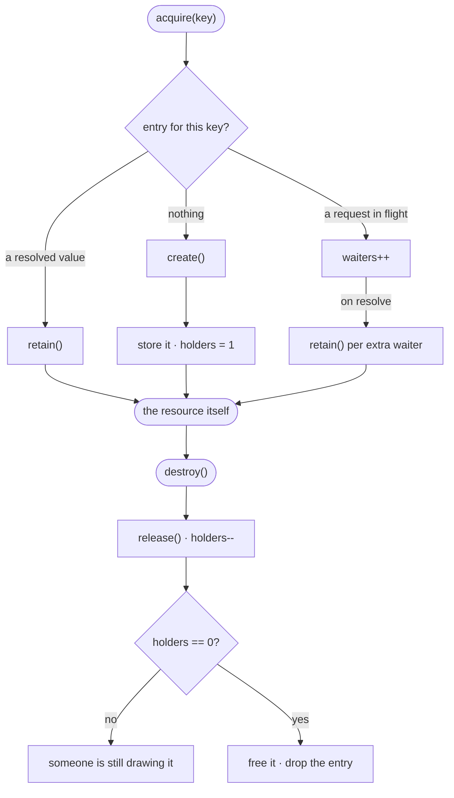
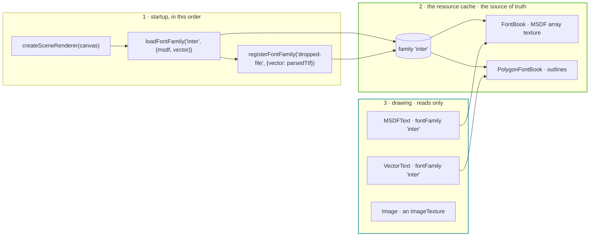

# Resources

How the engine shares the things that are slow to get: pictures, font atlases, glyph outlines.

> **Status.** This describes the target architecture. The holder counting, the keyed store and the
> image texture cache are built. The font registry, `fontFamily` on both text kinds, and the
> warn-and-draw-nothing policy are not — those sections are marked **planned**.

---

## The rule

**The cache is the source of truth, and the renderer never goes and gets anything.**

An application picks a render path once, at startup, before any resource is loaded, and keeps it:
WebGL2 exists because a machine may not have WebGPU, not so a running application can change its
mind. Swapping is a teardown and a restart. That single fact is what lets the cache hold
*finished* resources — an uploaded font atlas, a texture — rather than the ingredients for them.

So there is one cache, and everything in it is ready to draw with. The render lanes read; they
never fetch, decode or parse.

**It is cleared when the renderer is torn down.** A `FontBook` holds a texture belonging to one
device, so a cache outliving that device would hand out dead handles on the restart. Teardown
empties it, and the next startup fills it again in the same order.

---

## Sharing and counting

Every entry point — a URL, an SVG document, a font family — arrives at one keyed store with one
rule: built once, freed when the last holder lets go.



What comes back is the implementation's own object, never a wrapper. A render path narrows an
`ImageTexture` to reach its bind groups, and a proxy would fail that narrowing — so the holder
count rides on the resource itself, in `SharedLifetime`.

Two details that are invisible until they are wrong:

**Waiters are counted synchronously.** The second caller increments the count the moment it asks,
not in a `.then` after the fetch lands. The resolve handler was attached first, so by the time any
waiter holds the resource its count already includes them. Counting later leaves a window where
the builder could let go and free it underneath a waiter.

**The cache holds no reference of its own.** The entry is dropped by the resource's own last
release rather than by the cache deciding. A cache holding a reference keeps everything alive for
the life of the page; one expiring on a timer frees a texture a scene is still drawing.

---

## Startup order — **planned**

The order is not a convention, it is a dependency: building an MSDF atlas needs a device, so the
renderer exists first and the cache is filled against it.



A font arriving later than startup is allowed — a file the user drops in, a document naming its
own face — and lands in the same cache under its own name. What is not allowed is a render lane
reaching past the cache to fetch something itself.

---

## Font families — **planned**

A family is loaded once, by name, and both text implementations read it from the cache.

```ts
await loadFontFamily('inter', {
  msdf:   STYLES.map((style) => ({ style, metricsUrl: …, imageUrl: … })),
  vector: STYLES.map((style) => ({ style, url: … })),
})

new MSDFText({ text: 'Hello', fontFamily: 'inter' })    // atlas glyphs
new VectorText({ text: 'Hello', fontFamily: 'inter' })  // outline glyphs
```

Which of the two a node is remains a **choice made when it is written**, not something swapped at
runtime — one samples a distance field, the other tessellates real contours, and they have
different strengths (see [FONTS.md](FONTS.md)). Two nodes of different kinds in one scene is
ordinary. What the family name gives is a single way to say *which typeface*, whichever kind is
asking.

`loadFontFamily` does everything, and hands the renderer nothing to do but bind: fetch the
metrics, compute `atlasLayerSize` across the family, `normalizeMetrics` per style, fetch and
decode each atlas with `colorSpaceConversion: 'none'` — MSDF channels are distances, not sRGB
colour — upload the layers, and parse the outlines into a `PolygonFontBook`.

A font parsed at runtime is registered the same way, so there is one place a font can come from:

```ts
const book = await parseTtf(file)                          // @mvpaint/ttf
registerFontFamily('dropped-file', { vector: book })
new VectorText({ text, fontFamily: 'dropped-file' })
```

`VectorText` therefore takes no `fonts` object. The cache is the source of truth, and a node
names what it wants.

### A family that is not there

**The engine ships no typeface**, so there is nothing to fall back to and no pretending
otherwise. A node naming a family the cache does not hold draws **nothing**, and the engine
writes one `console.warn` naming the family — once per name, not once per frame, since the gather
runs every frame and a per-frame warning is a silent way to make a log useless.

This is the same for both text kinds. Neither has a default face, because neither has a face at
all until an application supplies one.

---

## What each entry point is keyed by

| Entry point | Keyed by |
| --- | --- |
| `images.load` | the URL |
| `images.fromSvg` | the document **and** its resolved pixel size — the same badge at 24px and at 128px are two textures |
| `images.fromSource`<br>`images.fromPixels` | an explicit `key`, or not shared. A bitmap is an object rather than a name, and the debug `label` deliberately keys nothing |
| `loadFontFamily` — **planned** | the family name |

---

## What is held in memory

Only what has to be, which for fonts is more than the pixels.

**Metrics and outlines are permanently CPU-resident**, and that is not a caching decision —
shaping runs on the CPU. Wrapping, kerning, alignment, hit-testing and `measureSize` all read the
glyph and kerning maps with no device in sight, so a `FontBook` keeps its `FontMetrics` and a
`PolygonFontBook` keeps its triangulated outlines for as long as anything can draw text.

**Pixels are not.** An atlas is decoded, copied into its array layer and let go of; an image the
same. Nothing keeps a second copy of what is already on the GPU. `loadPolygonFonts` shows the
discipline in miniature: it acquires each style's JSON through the cache, builds the book, then
releases the documents — two books sharing a style share that style's fetch, but hundreds of
kilobytes of raw outline data do not sit in memory beside the structures parsed out of them.

---

## Ending a hold

`destroy()` releases **one** holder:

```ts
const a = await handle.images.load('/logo.png')   // fetched, decoded, uploaded
const b = await handle.images.load('/logo.png')   // the same texture, no work at all
a.destroy()                                        // b is still drawing; nothing is freed
b.destroy()                                        // now it is
```

`Scene.own()` is where a builder's hold acquires an end:

```ts
const checker = scene.own(handle.images.fromPixels(pixels, 256, 256, 'checker'))
scene.dispose()   // destroys the tree, then releases everything own()ed, last first
```

The scene builder is the holder, not the `Image` node — one texture is often drawn by ten of
them, so a node taking a reference would mean two places to get the accounting right instead of
one. Destroying a renderer disposes its scene and empties the cache.

---

## Where the code is

| | |
| --- | --- |
| Holder counting | `resources/SharedLifetime.ts` |
| The keyed store | `resources/ResourceCache.ts`, `resources/globalCache.ts` |
| Image sharing | `resources/cachingImageFactory.ts`, wrapping `webgpu/ImageTexture.ts` and `webgl/GlImageTexture.ts` |
| Font sources | `resources/fontSources.ts` |
| Font registry — **planned** | `resources/FontRegistry.ts` |
| Building a family's atlas | `webgpu/FontBook.ts`, `webgl/GlFontBook.ts` |
| Scene lifetimes | `scene/Scene.ts` |

See [ARCHITECTURE.md](ARCHITECTURE.md) for the renderer around this, and [FONTS.md](FONTS.md) for
the font pipeline end to end — generation, loading, shaping, both render paths.
