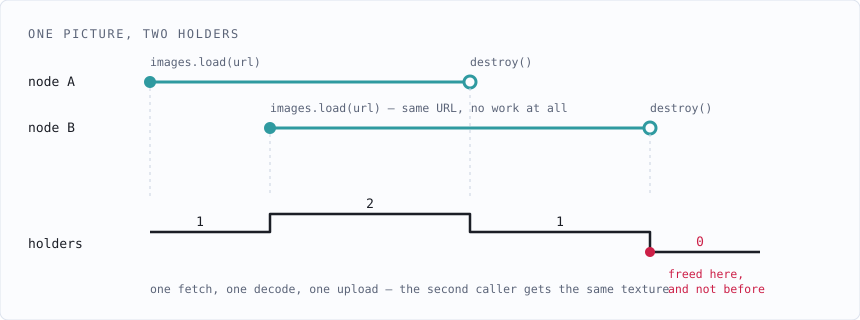
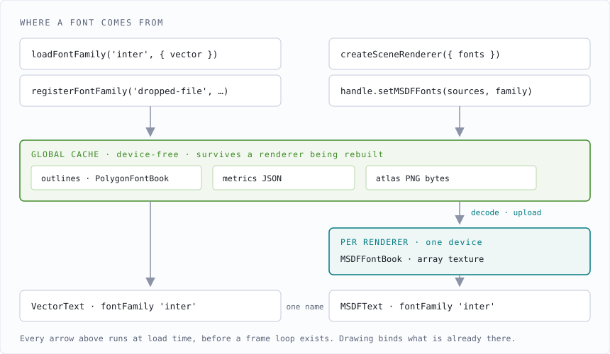

# Resources

How the engine shares the things that are slow to get: pictures, font atlases, glyph outlines.

This describes the code as it stands.

---

## Two rules

**A resource is built once and freed when the last holder lets go.** `destroy()` releases one
holder, not the resource.

**A font is reached by name.** Both kinds of text say `fontFamily: 'inter'`; nothing is handed a
font object. A name nothing was registered under draws nothing and says so once.

---

## One resource, many holders



```ts
const a = await handle.images.load('/logo.png')   // fetched, decoded, uploaded
const b = await handle.images.load('/logo.png')   // the same texture, no work at all
a.destroy()                                        // b is still drawing; nothing is freed
b.destroy()                                        // now it is
```

The count lives on the resource, in `SharedLifetime`, rather than in a wrapper around it. A
wrapper is the obvious design and it does not work here: a render path narrows an `ImageTexture`
to the implementation it created in order to reach its bind groups, and a proxy would fail that
narrowing.

Two details that are invisible until they are wrong:

**Waiters are counted synchronously.** A second caller arriving while the first fetch is still in
flight increments the count the moment it asks, not in a `.then` after the fetch lands. The
resolve handler was attached first, so by the time any waiter holds the resource its count
already includes it. Counting later leaves a window where the builder could let go and free it
underneath a waiter.

**The cache holds no reference of its own.** The entry is dropped by the resource's own last
release rather than by the cache deciding. A cache holding a reference keeps everything alive for
the life of the page; one expiring on a timer frees a texture a scene is still drawing.

### What is keyed by what

| Entry point | Keyed by |
| --- | --- |
| `images.load` | the URL |
| `images.fromSvg` | the document **and** its resolved pixel size — the same badge at 24px and at 128px are two textures |
| `images.fromSource`, `images.fromPixels` | an explicit `key`, or not shared. A bitmap is an object rather than a name, and the debug `label` deliberately keys nothing |
| `loadPolygonFonts` | the set of source URLs, order-independent |
| `loadMsdfAtlases` | each metrics URL |
| `sharedAtlasBytes` | the atlas PNG's URL |

---

## Where a font comes from



```ts
await loadFontFamily('inter', { vector: POLYGON_ATLAS_URLS })

new MSDFText({ text: 'Hello', fontFamily: 'inter' })    // atlas glyphs
new VectorText({ text: 'Hello', fontFamily: 'inter' })  // outline glyphs
```

Which of the two a node is stays a **choice made when it is written**, not something swapped at
runtime — one samples a distance field, the other tessellates real contours, and they have
different strengths (see [FONTS.md](FONTS.md)). Two kinds in one scene is ordinary. What the
family name gives is one way to say *which typeface*, whichever kind is asking.

A font parsed at runtime goes to the same place, which is why nothing takes a book:

```ts
registerFontFamily('dropped-file', { vector: await TtfFontBook.load(…) })
new VectorText({ text, fontFamily: 'dropped-file' })
```

Outlines and atlases are stored apart because one holds a device handle and the other does not. A
`PolygonFontBook` is arrays of numbers, so it sits in module state and any node resolves it
synchronously — which `VectorText` needs, shaping with no renderer in reach. An `MSDFFontBook`
holds a `GPUTexture`, so it lives in the renderer's `MSDFFontLibrary` and dies with it. Both are
reached by the same name, which is the part a caller sees.

### A family that is not there

**The engine ships no typeface.** There is nothing to fall back to, so a node naming a family
nothing was registered under draws **nothing**, and the engine writes one `console.warn` naming
it — once per name, not once per frame, since the gather runs every frame and a per-frame warning
is a silent way to make a log useless.

The same for both kinds. Neither has a default face, because neither has a face at all until an
application supplies one.

`DEFAULT_FONT_FAMILY` survives as the name a node gets when it chooses none. It is not a
fallback.

### Nothing is prepared while drawing

An atlas is fetched, decoded and uploaded when the family is **loaded** — inside
`createSceneRenderer`, which awaits it before a frame loop exists, or inside `setMSDFFonts`,
which the application awaits. `MSDFFontBook.buildAtlas` is reachable from those two places and
nowhere else. By the time a frame runs, the text lane binds a bind group that already exists.

The same rule holds for pictures: `images.load()` is awaited by whoever wants the texture, and
`ImageBatcher.rebuild()` makes every bind group its draw ranges will need — so `draw()`, which
runs with a pass open, only ever looks one up.

**Only the active path is prepared.** Each render path has its own textures because a texture
belongs to a device, but exactly one renderer exists for the life of the application. Nothing is
uploaded twice, and nothing is uploaded for a path that is not drawing.

The atlas PNG goes through the cache like everything else — `sharedAtlasBytes(url)`, keyed by
address — so a family rebuilt against the set it already had, or a renderer rebuilt after a
remount, does no round trip. What stays in the book is the decode and the upload, because both
need a device and the decoded form is far larger than the PNG it came from.

---

## What is held in memory

Only what has to be, which for fonts is more than the pixels.

**Metrics and outlines are permanently CPU-resident**, and that is not a caching decision —
shaping runs on the CPU. Wrapping, kerning, alignment, hit-testing and `measureSize` all read the
glyph and kerning maps with no device in sight, so an `MSDFFontBook` keeps its `FontMetrics` and a
`PolygonFontBook` keeps its triangulated outlines for as long as anything can draw text.

**Pixels are not.** An atlas is decoded, copied into its array layer and let go of; an image the
same. `loadPolygonFonts` shows the discipline in miniature: it acquires each style's JSON through
the cache, builds the book, then releases the documents — two books sharing a style share that
style's fetch, but hundreds of kilobytes of raw outline data do not sit in memory beside the
structures parsed out of them.

---

## Ending a hold

`Scene.own()` is where a builder's hold acquires an end:

```ts
const checker = scene.own(handle.images.fromPixels(pixels, 256, 256, 'checker'))
scene.dispose()   // destroys the tree, then releases everything own()ed, last first
```

The scene builder is the holder, not the `Image` node — one texture is often drawn by ten of
them, so a node taking a reference would mean two places to get the accounting right instead of
one. Destroying a renderer disposes its scene.

---

## Where the code is

| | |
| --- | --- |
| Holder counting | `resources/SharedLifetime.ts` |
| The keyed store | `resources/ResourceCache.ts`, `resources/globalCache.ts` |
| Image sharing | `resources/cachingImageFactory.ts`, wrapping `webgpu/ImageTexture.ts` and `webgl/GlImageTexture.ts` |
| Fetching font data | `resources/fontSources.ts` |
| Name to font | `resources/FontRegistry.ts` |
| MSDF atlases on the device | `webgpu/MSDFFontBook.ts`, `webgpu/MSDFFontLibrary.ts`, and the `Gl…` pair |
| Outlines | `text/PolygonFont.ts`, and `@mvpaint/ttf` for a font parsed at runtime |
| Scene lifetimes | `scene/Scene.ts` |

The two diagrams above are hand-authored SVG in `docs/`. See [docs/README.md](docs/README.md)
for how they and the generated ones are made.

See [ARCHITECTURE.md](ARCHITECTURE.md) for the renderer around this, and [FONTS.md](FONTS.md) for
the font pipeline end to end — generation, loading, shaping, both render paths.
